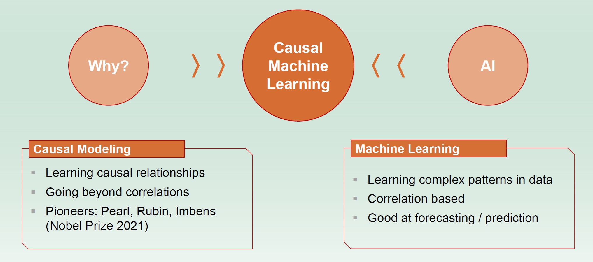
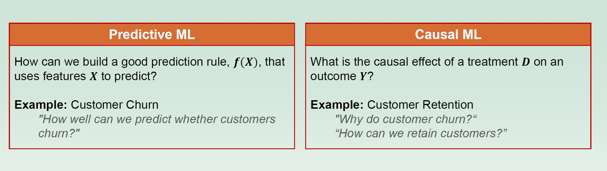
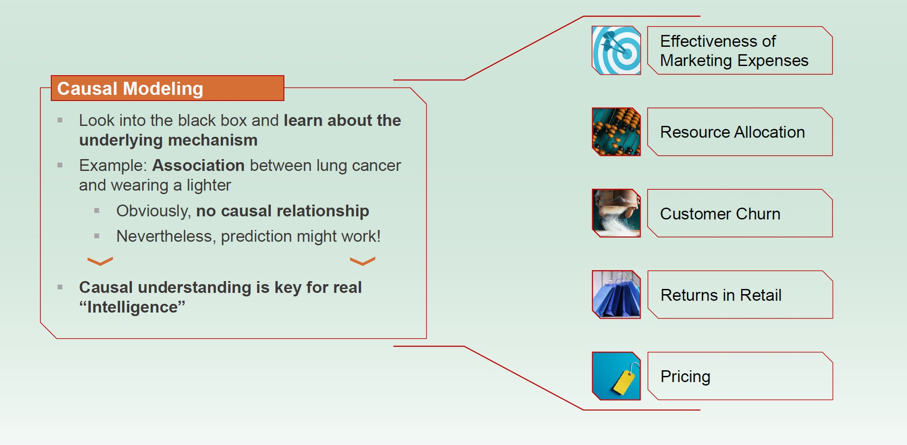
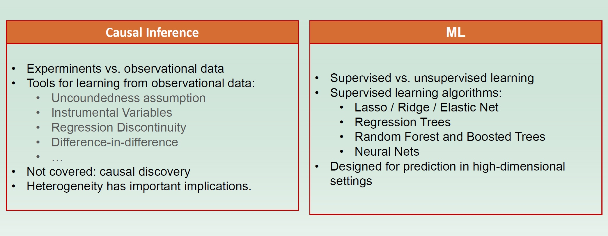
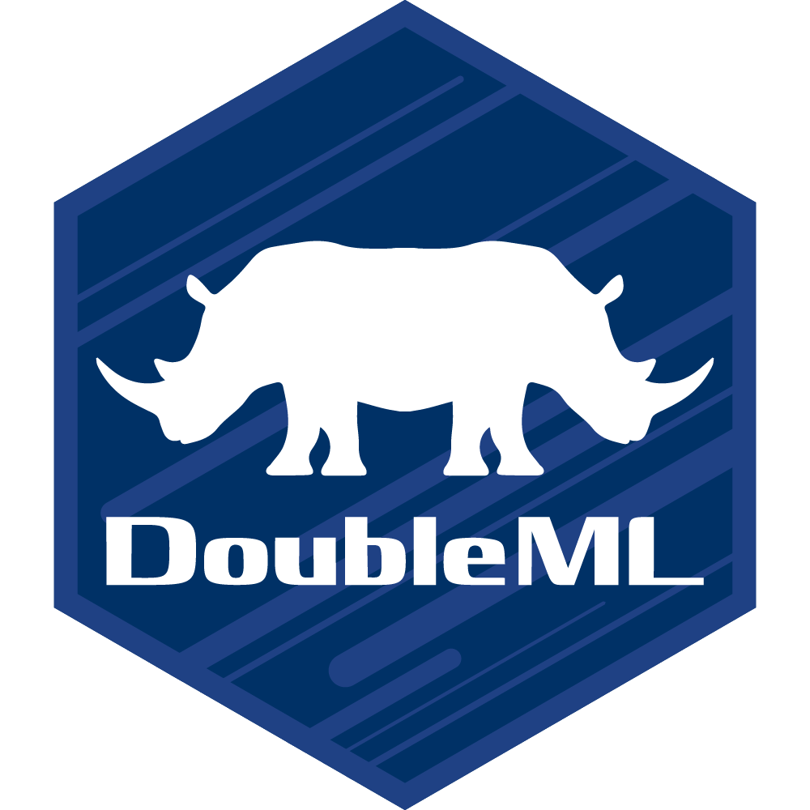

## About me

-   Professor of Data Science in Economics
-   Mainly working on development of new statistical/ machine learning methods for the estimation of causal parameters in econometric models
-   Research Interest: High-dimensional Statistics, Causality, Machine Learning
-   Teaching: Causal Inference, Machine Learning, Econometrics, Statistics, Programming
-   Contact: kueck\@dice.hhu.de

## Organizational Matters

**Lectures**

- Wednesday (16:30-18:00h)

**Tutorials**

-   Thursday (08:30 - 10:00h)
-   We will work with R Notebooks. You can use [R in VS Code](https://code.visualstudio.com/docs/languages/r) or [Google Colab](https://colab.research.google.com/) for this.
-   The notebooks will be provided [here](https://maramattes.github.io/CML-HHU/).
<!-- -   Please make sure you can log in to your Google account and check if you can open the following notebook from this [link](https://drive.google.com/file/d/1lvEb65tY0d0X_IngFwO2YxJwTciJvXAF/view?usp=sharing) (click on "open with Google Colaboratory").
- If you prefer to work locally on your device, feel free to use RStudio available [here](https://posit.co/download/rstudio-desktop/). -->

**Grading**

- Oral exam at the end of the semester 

## Organizational Matters

**Lectures**

::: {.blue-box}
- Wednesday (16:30-18:00h) Please note that there will be no lecture on July, 1!
::: 

**Tutorials**

::: {.blue-box}
-   Thursday (08:30 - 10:00h) Please note that there will be no tutorial on July, 2!
::: 

<!-- -   We will work on R Notebooks using [Google Colab](https://colab.research.google.com/). -->
<!-- -   Links to the notebooks will be provided via lecture notes or google docs. -->
<!-- -   Please make sure you can log in to your Google account and check if you can open the following notebook from this [link](https://drive.google.com/file/d/1lvEb65tY0d0X_IngFwO2YxJwTciJvXAF/view?usp=sharing) (click on "open with Google Colaboratory"). -->
<!-- - If you prefer to work locally on your device, feel free to use RStudio available [here](https://posit.co/download/rstudio-desktop/). -->

<!-- **Grading** -->

<!-- - Oral exam at the end of the semester (probably on July 25, 2024) -->

## Course Outline

The course will cover the following topics:^[Any feedback on slides and the content will be greatly appreciated as I iterate over the material]

-   Predictive Inference with Linear Regression
-   Basics in Causal Inference (Randomized Experiments, ...)
-   Machine Learning Methods (Lasso, Random Forests, ...)
-   Statistical Inference in High-dimensional Linear Regression
-   Causal Inference via Conditional Exogeneity
-   Structural Equations and DAGs
-   Statistical Inference in Modern Nonlinear Regression
-   Double Machine Learning
-   Optional Advanced Topics (high-dimensional IV models, Difference-in-Differences with Machine Learning, Panel data, Sensitivity Analysis, ...)

<!-- ## Description -->

<!-- The course will cover basic principles of **causal inference** and **machine learning** and how the two can be combined in practice to deliver estimates for causal parameters in real world datasets.  -->
<!-- The lectures will cover fundamentals, e.g. econometric models and DAGs and introduce tools for statistical inference based on machine learning (lasso, random forest, ...) to **infer** causal parameters and **quantify uncertainty**. We apply machine learning methods to handle **high-dimensional data**. The tutorials will involve real world and simulated data analysis in **R** based on these methodologies. -->
<!-- Lectures and tutorials will be on-site and will not be recorded.  -->

## Causal machine learning

{width=300}

<!-- ## Causal machine learning combines two literatures -->

<!-- **Machine Learning**: -->

<!-- Machine learning algorithms build a model based on sample data, known as training data, in order to make good predictions or decisions. Often, these methods are applied without further consideration even if the goal is to uncover some causal answers: -->

<!-- -   Resource allocation -->
<!-- -   Predict the quality of a new promotion -->
<!-- -   Forecast the turnover for a new product -->

<!-- **Causality**: -->

<!-- Influence by which one event contributes to the production of another event where the cause is partly responsible for the effect. -->

<!-- $\Rightarrow$ **Causal Machine Learning:** Use the predictive power of modern machine learning algorithms to provide precise estimates for causal effects/parameters!  -->

## Prediction vs. Causal Inference

{width=300}

## Causal Inference

{width=300}

## Causal Inference and Machine Learning

{width=300}

## What to expect

-   Recap/learn the **Causal Inference** and **Machine Learning** basics
-   Learn econometric models for high-dimensional data
-   Learn recent Causal ML methods (e.g. **Double Machine Learning**) for estimation of (average) treatment effects
-   Get to know recent software (e.g. DoubleML package in R) to apply Causal ML algorithm in practice
-   Guest lecture with one of the developers of the DoubleML package

{width="100%" fig-align="center"}

------------------------------------------------------------------------

## Some suggested textbooks

- Trevor Hastie, Robert Tibshirani & Jerome Friedman: [The Elements of
Statistical Learning](https://hastie.su.domains/ElemStatLearn/)
- Scott Cunningham: [Causal Inference: The Mixtape](https://cdn1.sph.harvard.edu/wp-content/uploads/sites/1268/2022/12/hernanrobins_WhatIf_20dec22.pdf)
- Miguel A. Hernan and James M. Robins: [Causal Inference, What If](https://cdn1.sph.harvard.edu/wp-content/uploads/sites/1268/2022/12/hernanrobins_WhatIf_20dec22.pdf)
- Judea Pearl, Madelyn Glymour, Nicholas P. Jewell: [Causal Inference in Statistics: A primer](https://www.wiley.com/en-us/Causal+Inference+in+Statistics%3A+A+Primer-p-9781119186847)
- Victor Chernozhukov, Christian Hansen, Nathan Kallus, Martin Spindler and Vasilis Syrgkanis: [Applied Causal Inference powered by ML and AI](https://causalml-book.org/)
- Martin Huber: [Causal Analysis: Impact Evaluation and Causal Machine Learning with Applications in R](https://mitpress.mit.edu/9780262545914/causal-analysis/)

- Great [causalML course](https://github.com/MCKnaus/causalML-teaching) by Michael Knaus (University of Tübingen) with a focus on impact/policy/program evaluation.

## Credits

The course is based on the book "Applied Causal Inference powered by ML and AI" (available [here](https://causalml-book.org/)). I would like to thank the authors Victor Chernozhukov, Christian Hansen, Nathan Kallus, Martin Spindler and Vasilis Syrgkanis for sharing the materials.

