# Machine Learning Methods

## Linear Regression with High-Dimensional Covariates

-   We consider a regression model $$
    Y = \beta' X + \epsilon, \quad \epsilon \perp X,
    $$ where $\beta'X$ is the population best linear predictor of $Y$
    using $X$, or simply the population linear regression function.

-   The vector $X = (X_j)_{j=1}^p$ is $p$-dimensional. That is, there
    are $p$ regressors, and $$
     p \textbf{ is large, possibly much larger than }  n.
    $$

-   This case where $p$ is very large is what we call a
    "high-dimensional" setting.

-   High-dimensional settings arise when data have large dimensional
    features (i.e. many covariates are available for use as regressors),
    or we construct many technical regressors. A *technical regressor*
    is any variable obtained as a transformation of a basic regressor
    from raw regressors.

## Constructed Regressors

-   Examples of datasets where many covariates are available and
    potential corresponding exemplary applications include country
    characteristics in cross-country wealth analysis, housing
    characteristics in house pricing/appraisal analysis, individual
    health information in electronic health records and claims data, and
    product characteristics at the point of purchase in demand analysis.

-   Another source of high-dimensionality is the use of constructed
    regressors. If $W$ are "raw" regressors, *technical (constructed)
    regressors* are of the form $$
    X = P(W) = (P_1(W),..., P_p (W))',
    $$ where the set of transformations $P(W)$ is sometimes called the
    "dictionary" of transformations.

-   Example transformations include polynomials, interactions between
    variables, and applying functions such as the logarithm or
    exponential.

## Motivation

-   In the wage analysis in Lecture 1, for example, we used quadratic
    and cubic transformations of experience, as well as interactions
    (products) of these regressors with education and geographic
    indicators.
    
-   The main motivation for the use of constructed regressors is to
    build **more flexible and potentially better** prediction rules.

-   The potential for improved prediction arises because we are using
    prediction rules $\beta'X=\beta'P(W)$ that are **nonlinear** in the
    original raw regressors $W$ and may thus capture more complex
    patterns that exist in the data.

-   Conveniently, the prediction rule $\beta'X$ is still linear with
    respect to the parameters, $\beta$, and with respect to the
    constructed regressors $X = P(W)$, so inherits much from the
    previous discussion of linear regression provided in Lecture 1.

## Best Predictor

-   In the population, the **best predictor** of $Y$ given $W$ is $$g(W) = \mathbb{E}[Y \mid W],$$ the **conditional expectation** of $Y$ given $W$. The function
    $g(W)$ is called the **regression function** of $Y$ on $W$.

-   Specifically, the conditional expectation function $g(W)$ solves the
    best prediction problem $$
      \min_{m(W)} \mathbb{E}[(Y - m(W))^2].
      $$

-   Here we minimize the mean squared prediction error (MSE) among all
    prediction rules $m(W)$ (linear or nonlinear in $W$).

------------------------------------------------------------------------

-   As the conditional expectation solves the same problem as the best
    linear prediction rule among a larger class of candidate rules, the
    conditional expectation generally provides better predictions than
    the best linear prediction rule (unless the conditional expectation
    function turns out to be linear, in which case the conditional
    expectation and best linear prediction rule coincide).
    
-   By using $\beta'P(W)$ we are implicitly approximating the **best
    predictor** $\mathbb{E}[Y|W]$.

-   It can be shown that the **best linear predictor** (BLP) $\beta'P(W)$ is the **Best Linear Approximation (BLA)** to the
    best predictor -- the regression function $g(W)$.

-   By using a richer and richer dictionary $P(W)$ of transformations,
    the BLA $\beta'P(W)$ approximates $g(W)$ better and better.

------------------------------------------------------------------------

::: {#exm-approx} 
# Approximating A Smooth Function with a Polynomial Dictionary

- Suppose $W \sim U(0,1)$ and $g(W) = \exp(4\cdot W)$.

- We use
$$P(W) = \underbrace{(1, W,W^2, \ldots ,W^{p-1})'}_{p \text{ terms}}$$
to form the BLA/BLP, $$\beta'P(W).$$

- How can we approximate g(W) accurately?

:::

------------------------------------------------------------------------ 

- With $p=2$ we get a linear in $W$ approximation to $g(W)$. As the figure shows, the quality of this       approximation is poor:

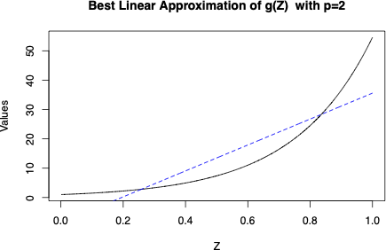{#fig-p3  width=80%}

------------------------------------------------------------------------   

-   With $p=3$ we get a quadratic-in-$W$ approximation to $g(W)$. Here,
    the approximation quality is markedly improved relative to $p=2$
    though approximation errors are still clearly visible:
    
    
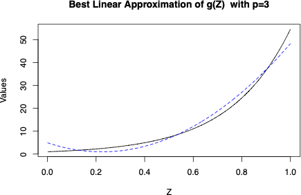{#fig-p3}

------------------------------------------------------------------------   

-   With $p=4$ we get a cubic-in-$W$ approximation to $g(W)$, and the
    quality of approximation appears to be excellent:
    
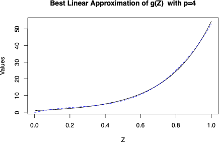{#fig-p4}

- This simple example highlights the motivation for using nonlinear transformations of raw regressors in linear regression analysis.
    

## Regression

- Recall that we are considering a regression model 
$$
Y = \beta' X + \epsilon = \sum_{j=1}^p \beta_j X_j + \epsilon,  \quad \epsilon \perp X
$$
where $p$ is possibly much larger than $n$.  

- We further assume that regressors are normalized, $\mathbb{E}[X^2_j]=1$, 
 to discuss theoretical properties. 

- Classical linear regression or least squares fails in these high-dimensional settings because it overfits the data. 

- This is especially apparent when $p \geq n$. We therefore make some assumptions and modify the  regression method in order to deal with cases where $p$ is large. 

------------------------------------------------------------------------   

- An intuitive starting point is the assumption of **approximate sparsity**. 

- Under approximate sparsity, there is a small group of regressors with relatively large coefficients whose use alone suffices to approximate the BLP $\beta'X$ well. 

- The rest of the regressors are assumed to have relatively small coefficients and contribute little to the approximation of the BLP.

<!-- - An example of approximate sparsity is captured by regression coefficients of the form -->

<!-- $$\beta_j \propto 1/j^2, \quad j=1,...,p.$$   -->

- Here, the first few coefficients capture almost all of the explanatory power of the full vector of   coefficients as shown in the following figure:

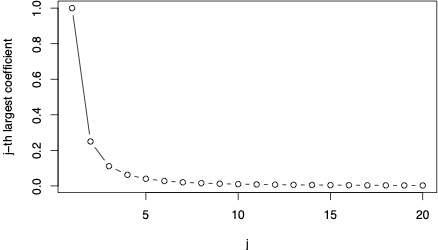{#fig-approxsparsity}

## Approximate Sparsity

- The sorted absolute values of the coefficients decay fast enough. Specifically, the j$^{th}$ largest coefficient (in absolute value) denoted by $|\beta|_{(j)}$ obeys
$$
\begin{equation}
|\beta|_{(j)} \leq  A j^{-a}, \quad  a>1/2,\end{equation}
$$
for each $j$, where the constants $a$ and $A$ do not depend on the sample size $n$.

## Lasso

- Consider a random sample $(Y_i, X_i)_{i=1}^n$. We seek to construct a good linear predictor $\hat \beta'X$, which works well when $p/n$ is not small. 

- Lasso constructs $\hat \beta$ as the solution of the following penalized least squares problem:

$$
\min_{b \in \mathbb{R}^p} \quad \sum_i (Y_i - b'X_i )^2 +  \lambda  \cdot \sum_{j=1}^p | b_j| \hat \psi_j ,
$${#eq-lasso}
  which is called the Lasso regression problem. 

- The first term is $n$ times the sample mean squared error, and the second term is called a *penalty term*. 

## Penalty

- The penalty term introduces a cost to the size of the prospective model where size is captured by the sum of the products of the absolute values of the coefficients $b_j$ with the *penalty loadings* $\hat \psi_j$ all multiplied by the *penalty level* $\lambda$. The penalty loadings are typically set as 
$$
\hat \psi_j = \sqrt{\mathbb{E}_n X^2_{ij}}.
$$
- The use of this penalty ensures invariance of Lasso predictions to rescaling $X_j'$. It is also        desirable to demean $X_j'$s other than the intercept, 
  as this will ensure invariance of predictions to both location and scale transformations of $X_j's$. 

- As long as $\lambda > 0$, the introduction of the penalty term in @eq-lasso leads to a prediction rule which is less complex than the rule that would be obtained via solving the unpenalized least squares problem. 

------------------------------------------------------------------------   

- This preference for less complex models then helps guard against overfitting which can intuitively be understood as adding complexity to a prediction rule to capture some small variation in the sample that does not generalize out of sample. 

- A crucial point is thus the choice of the penalization parameter $\lambda$.  A theoretically valid choice is 
$$ \lambda = 2 \cdot c \hat \sigma \sqrt{n} \Phi^{-1}( 1-\alpha/2p)$$
 with $\hat \sigma \approx \sigma = \sqrt{\mathbb{E} \epsilon^2}$ obtained via an iteration method.
- $\Phi^{-1}$ denotes the quantile function (inverse) of the distribution function the standard normal variable $N(0,1)$, $\Phi(z) = P (N(0,1) \leq z)$ and $c>1$  and $1-\alpha$ is a confidence level.

- This penalty level ensures that the Lasso predictor $\hat \beta'X$ does not overfit the data and delivers good predictive performance under approximate sparsity (@BickelRitovTsybakov2009,@BC-PostLASSO). 

------------------------------------------------------------------------   

- Another good way to pick the penalty level is by cross-validation. Cross-validation is a form of a repeated data-splitting method to choose penalty parameters for Lasso and to choose among predictive models more generally. We outline the basic idea of cross-validation later.

- Approximate sparsity is produced because the penalty function has a kink at zero, so the marginal cost of including regressor $X_j$ is always positive.

- Therefore, Lasso includes a regressor $X_j$ only if its marginal predictive ability is higher than this threshold. We explain this point and how this feature of Lasso means that Lasso does variable selection in more detail below.

## Example

Consider
 $$ Y = \beta'X + \varepsilon, \ \ X \sim N(0,I_p), \ \ \varepsilon \sim N(0,1),$$
with approximately sparse regression coefficients:
 $$ \beta_j = 1/j^2,  \quad j=1,...,p$$
and
$$
n = 300, \quad p=1000.
$$

------------------------------------------------------------------------   

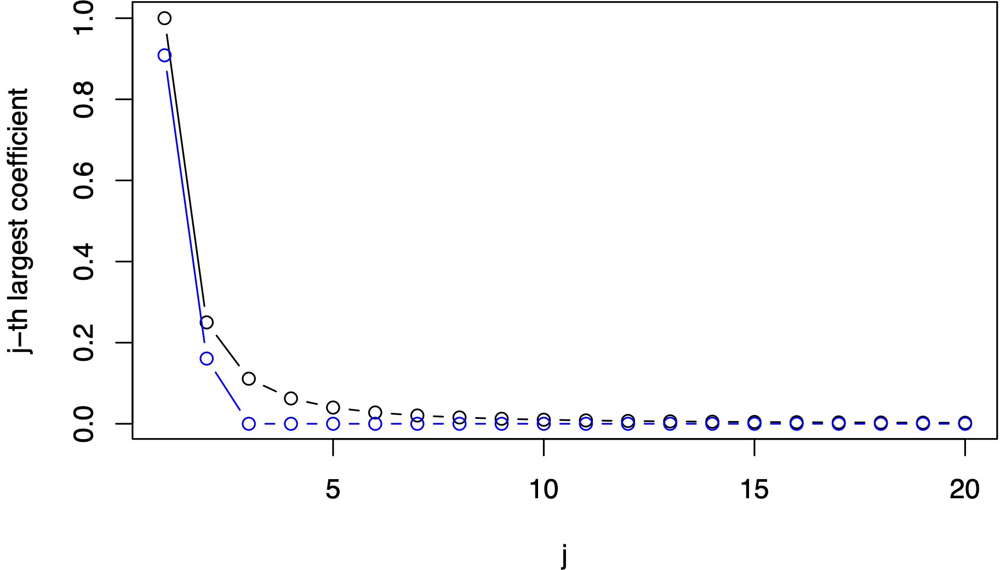{#fig-approxlasso}

------------------------------------------------------------------------   

- @fig-approxlasso shows that $\hat \beta$  is sparse and is  close to $\beta$. We see that Lasso sets     most of regression coefficients to zero.  It figures out approximately
  the right set of regressors, including only those with the two largest coefficients.  
  
- Lasso also shrunks relevant regressors towards zero and "underestimates" the absolute value of the coefficients.

## Post-Lasso

- We can use the Lasso-selected set of regressors, those regressors whose Lasso coefficient estimates are non-zero, to refit the model by least squares. 

- This method is called "least squares post Lasso" or simply *Post-Lasso* (@BC-PostLASSO). 

- We define the Post-Lasso 
$$
\widetilde \beta \in \arg\min_{\beta \in \mathbb{R}^p} \ \sum_i (Y_i-X_i'\beta)^2 \ \ :  \ \ \beta_j = 0  \text{ if } \hat \beta_j = 0,  \text{ for each } j,
$$ {#eq-postlasso}
where $\hat \beta$ is the Lasso coefficient estimator. 

- The formal properties of the Post-Lasso estimator $\widetilde{\beta}$
  are similar to those of Lasso $\hat{\beta}$, as recorded later.

------------------------------------------------------------------------   

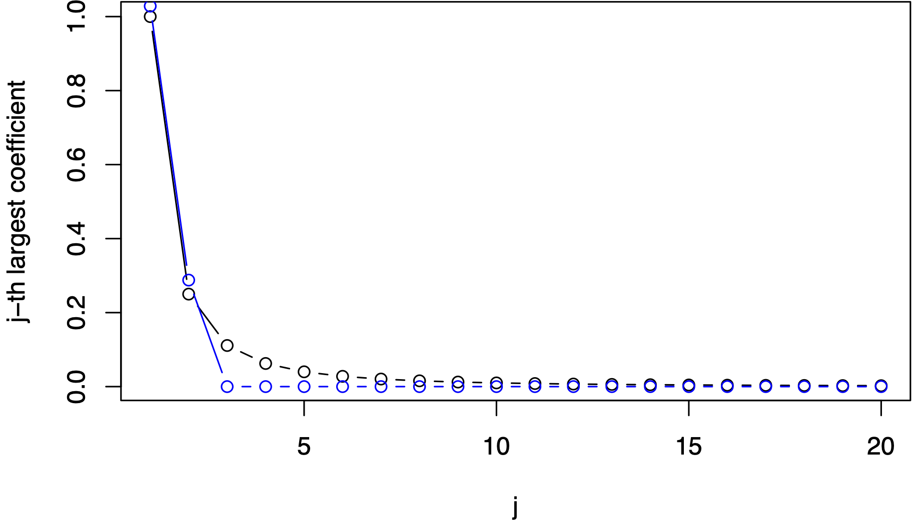{#fig-approxpostlasso}

## Predictive Performance of Lasso and Post-Lasso

- Does $\hat{\beta}'X$ provide a good approximation to the best linear prediction rule (out-of-sample) $\beta'X$?  

- Under approximate sparsity, only  a few, say $s$, parameters
will be "important". We can call $s$ the **effective dimension**.

- Under exact *sparsity*, there are only $s$ non-zero coeffiencients.

- Intuitively, to  estimate each of the "important" $s$ parameters well, we need many observations for each such parameter. This means that $n/s$ must be large. 

- Using previous reasoning from least squares theory with $s < n$ regressors, we might also conjecture that the key determinant of the rate at which Lasso approximates the best linear predictor is $\sqrt{s/n}$.

------------------------------------------------------------------------   

::: {#thm-lasso}

# Prediction Rate

Under the approximate sparsity assumption and other regularity conditions
stated e.g. in @BC-PostLASSO, with probability approaching $1-\alpha$ as $n \to \infty$, the following bound holds:
$$
\sqrt{\mathbb{E}[( \beta'X - \hat\beta'X)^2}] \leq  \mathrm{const}   \cdot \sqrt{\mathbb{E}[ \epsilon^2 ]} \sqrt{\frac{s \log (p \vee n) }{n} },
$$
where $s$ denotes the effective dimension. Moreover,  the number of regressors selected by  Lasso is bounded by
 $$\mathrm{const} \cdot s$$
with probability approaching $1-\alpha$ as $n \to \infty$.  

:::

------------------------------------------------------------------------  

- Therefore, if $s \log (p \vee n) /n$ is small, Lasso and Post-Lasso regression come close to the population regression function/best linear predictor.

- Relative to our conjectured rate $\sqrt{s/n}$, there is an additional factor $\sqrt{ \log (p \vee n)}$ in the bound. 

- This factor captures the price of not knowing *a priori* which of the $p$ regressors are the $s$ important ones. 

- Lasso approximately finds these important predictors, but correspondingly suffers a loss relative to a predictor estimated with knowledge of the best $s$-dimensional model.

- A theoretical guarantee similar to @thm-lasso has been established for cross-validated Lasso (@lasso:cv).

- Under approximate sparsity and with appropriate choice of penalty parameters, Lasso and Post-Lasso will approximate the best linear predictor well. 

## Other Penalized Regression Methods for Prediction

- Instead of the Lasso penalty term, other penalty schemes can be used, leading to different regression estimators with different properties. 

- These estimators are motivated by different structures for the coefficients on the set of regressors in a high-dimensional model. 

- We consider three important settings: sparse, dense, and sparse+dense. On the next slide, @fig-sparsedense illustrates each setting. 

- We have already outlined Lasso regression, which performs best in an approximately sparse setting.

------------------------------------------------------------------------  

{#fig-sparsedense}

## Ridge

- Next we consider the Ridge method, which performs best in the dense setting.

- The Ridge method estimates coefficients by penalized least squares, where we minimize the sum of squared prediction error plus the penalty
term given by the sum of the squared values of the coefficients times a
  penalty level $\lambda$:
  
$$\hat{\beta}(\lambda)=\arg \min_{b \in \mathbb{R}^p} \sum_{i=1}^n (Y_i - b'X_{i})^2 + \lambda \sum_j b_j^2.$$ {#eq-ridge}

- Ridge balances the complexity of the model measured by the sum of squared coefficients with the goodness of in-sample fit. 

- In contrast to Lasso, Ridge penalizes the large values of coefficients much more aggressively and small values much less aggressively -- indeed,  squaring big values makes them even bigger and squaring small numbers makes them even smaller.

------------------------------------------------------------------------  

- Because of the latter property, Ridge does not set estimated coefficients to zero and so it does not do variable selection.

- The Ridge predictor $\hat \beta'X$ is especially well suited 
  for prediction in "dense" models, where the $\beta_j$'s  are all small without necessarily being approximately sparse. 
  
- In the dense case, the Ridge predictor can easily outperform the Lasso predictor.

- Finally, we note that, in practice, we can choose the penalty level $\lambda$ in Ridge by cross-validation (or sample splitting).

## Elastic Net

- Ridge and Lasso have other useful modifications or hybrids that can perform well in the sparse, dense or sparse + dense settings. 

- One popular modification is the Elastic Net (@elnet) that can perform well in either the sparse or the dense scenario with appropriate tuning (though not in the sparse+dense case).

- The Elastic Net method estimates coefficients by penalized least squares with the penalty given by a linear combination of the Lasso and Ridge penalties:
$$\hat{\beta}(\lambda_1, \lambda_2)=\arg \min_{b \in \mathbb{R}^p} \sum_i (Y_i - b'X_{i})^2 + \lambda_1  \sum_j b_j^2  + \lambda_2 \sum_j |b_j|.$$ {#eq-enet}

- We see that the penalty function has two penalty levels $\lambda_1$ and $\lambda_2$, which could be chosen by cross-validation in practice. 

------------------------------------------------------------------------  

- By selecting different values of penalty levels $\lambda_1$ and $\lambda_2$, we have more flexibility with Elastic Net for building a good prediction rule than with just Ridge or Lasso.

- The Elastic Net performs variable selection unless we completely shut down the Lasso penalty by setting $\lambda_2 =0$. 

- With proper tuning, Elastic Net works well in regression models where regression coefficients are either approximately sparse or dense.

- We don't yet have good theoretical guarantees on predictive performance for the Elastic Net method.

## Choice of Regression Methods in Practice

- How should we select the appropriate penalized regression method? 

- The answer is simple if we are interested in building the best prediction.  We can use data splitting
into training and testing sets, and simply choose the method that performs the best on the test 
set.

- We show an example of this approach in the R notebook on predicting wages in CPS 2015 data. 
We can also use ensemble methods to aggregate prediction methods to get boosts in predictive performance.

## Introduction to Non-linear Regression Methods

- Here we discuss nonlinear regression methods based on tree models. 

- Tree-based methods include regression trees, random forests, and boosted trees. Regression trees are     great for exploration and explainable analytics, while random forests and boosted trees are great predictive tools 
  for structured data and data sets of intermediate size (say, up to several million observations).

- We are interested in predicting an outcome $Y$ using raw regressors $Z$, which are $k$-dimensional. The best prediction rule $g(Z)$ under square loss is the conditional expectation (CE) of $Y$ given $Z$:
$$
g(Z) = \mathrm{E}(Y |Z).
$$

- In previous chapters, we used best linear prediction rules to approximate $g(Z)$ and 
linear regression or Lasso regression for estimation.

- Now we consider nonlinear prediction rules to approximate $g(Z)$, focusing on tree-based methods.

## Important!

- The use of Best Prediction rules (CEs) is not just important for generating good predictions, but is crucial for causal inference. 

- Identification of causal parameters such as ATE via conditioning strategies requires us to work with CEs rather than with best linear prediction rules. 

- Previously we tried to make best linear prediction rules flexible to try to approximate best prediction rules. In the following, we explore fully nonlinear strategies.

## Introduction to Regression Trees

- Regression Trees are based on partitioning the regressor space (the space where $Z$ takes on values)     into a set of rectangles. A simple model is then fit within each rectangle. 

- The most common approach fits a simple constant model within each rectangle, which corresponds to approximating the unknown function by a  "step function". Given a partition into $M$ regions, denoted $R_1, \ldots, R_M$ the approximating function when a constant is fit within each rectangle is given by
$$ f(z)=\sum_{m=1}^M \beta_m 1(z\in R_m),$$
where $\beta_m, m=1,\ldots,M,$ denotes a constant for each region and $1(\cdot)$ denotes the indicator function. 

------------------------------------------------------------------------  

- Suppose we have $n$ observations $(Z_i,Y_i)$ for $i=1,\ldots,n.$
The estimated coefficients for a given partition are obtained by minimizing the in-sample MSE:
$$
\hat \beta = \arg\min_{b_1,..., b_M} \mathbb{E}_n\left (Y_i -  \sum_{m=1}^M b_m 1(Z_i \in R_m) \right )^2,
$$
so that
$$ \hat \beta_m = \text{ average of } Y_i \text{ where } Z_i \in R_m.$$

- The regions  $R_1, \ldots, R_M$ are called nodes, and each node $R_m$ has a predicted value $\hat \beta_m$ associated with it.

------------------------------------------------------------------------  

- @fig-tree1 illustrates a simple regression tree for the wage data:

{#fig-tree1}

------------------------------------------------------------------------  

- This tree has a depth of two, meaning that predictions are produced as a sequence of two binary decisions (or partitions of the data). 

- Starting at the top of the tree and working down provides a simple prediction rule for any observation.

- The key feature of trees is that the cut points for the partitions are adaptively chosen based on the data. That is, the splits are not pre-specified but are purely data dependent. So, how did we use the data to grow the tree in @fig-tree1 ? 

- To make computation tractable, we use recursive binary partitioning or splitting of the regressor space. First, we cut the regressor space into two regions by choosing the regressor and splitting point such that using the prediction rule fit within each region produces the best improvement in the in-sample MSE.

- Finding this split point requires trying the partition produced by splitting the data along every possible value of every observed variable. That is, we are neither pre-specifying which variables nor which split points are important in providing a good prediction rule.

------------------------------------------------------------------------  

- Applying this procedure in the wage data gives us the depth 1 tree shown in @fig-tree2. In this case, the best regressor to split on is the indicator of college degree, that takes values 0 or 1. Here splitting at any point between 0 and 1 provides the same rule, and an often used convention for binary variables is to use the "natural" split point of 0.5. Applying this split point yields the initial prediction rule: an hourly wage of $20$ for college graduates and $13$ for others.

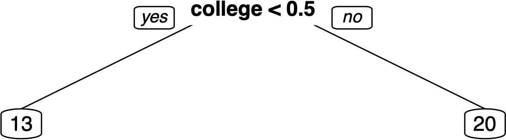{#fig-tree2}

------------------------------------------------------------------------   

- To grow the tree to depth 2, we then repeat the procedure for choosing the first partition rule within the two regions resulting from the first step. This step will result in a partition of the covariate space into four new regions.

- It is important to note that the two splits produced at this point may use different variables/splitting points than before.

- This feature means that the tree alogirthm can create "interactions" and "nonlinearities" without requiring input from the user.

------------------------------------------------------------------------   

- To grow deeper trees corresponding to more complex prediction rules, we simply keep repeating. We stop when the desired depth of the tree is reached, or when a prespecified minimal number of observations per region, called minimal node size, is reached.

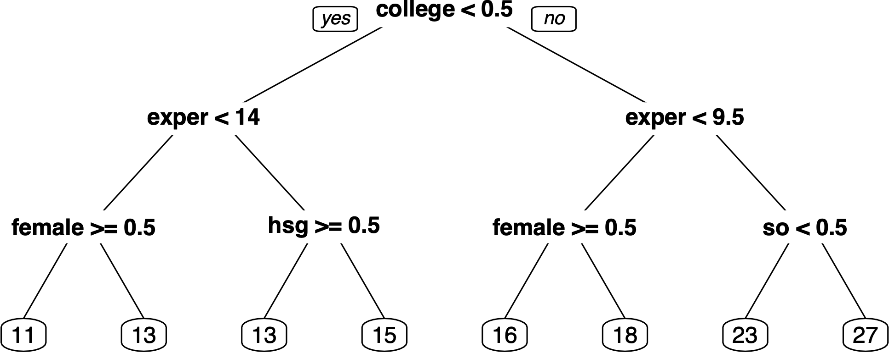{#fig-tree3}

------------------------------------------------------------------------ 

- First, the deeper we grow the tree, the better is our approximation to the regression function $g(Z)$. 

- However, the deeper the tree, the noisier our estimate
$\hat g(Z)$ becomes (overfitting), since there are fewer observations per terminal node to estimate the predicted value for this node. 

- From a prediction point of view, we can try to find the right depth or the structure of the tree by sample-splitting (cross-validation). For example, in the wage example, the tree of depth 2 performs better in terms of cross-validated MSE than the tree of depth 3 or 1.

## Random Forest

- In practice, regression trees often do not provide the best predictive performance, because a single regression tree provides a relatively crude approximation to a smooth regression function $g(Z)$.

- We illustrate the potential poor approximation of regression trees in @fig-shallow and @fig-deep. These figures simply illustrate that step functions, which are the outputs of typical regression tree implementations, struggle in approximating smooth functions.

- A powerful and widely used approach that aims to improve upon simple regression trees is to build a *Random Forest,* as proposed by Leo Breiman (@breiman). 

- The idea of a Random Forest is to grow many different deep trees that have low approximation error and then average the prediction rules across trees.

------------------------------------------------------------------------ 

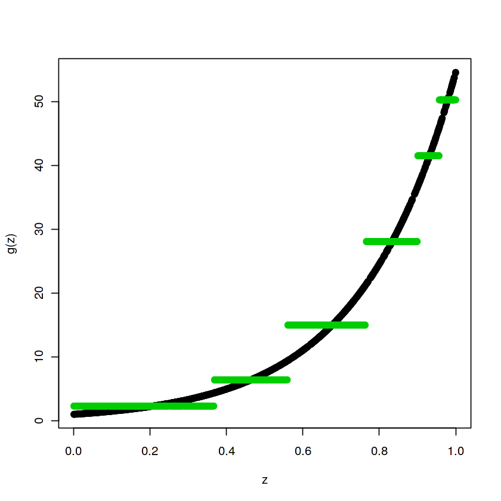{#fig-shallow}

------------------------------------------------------------------------ 

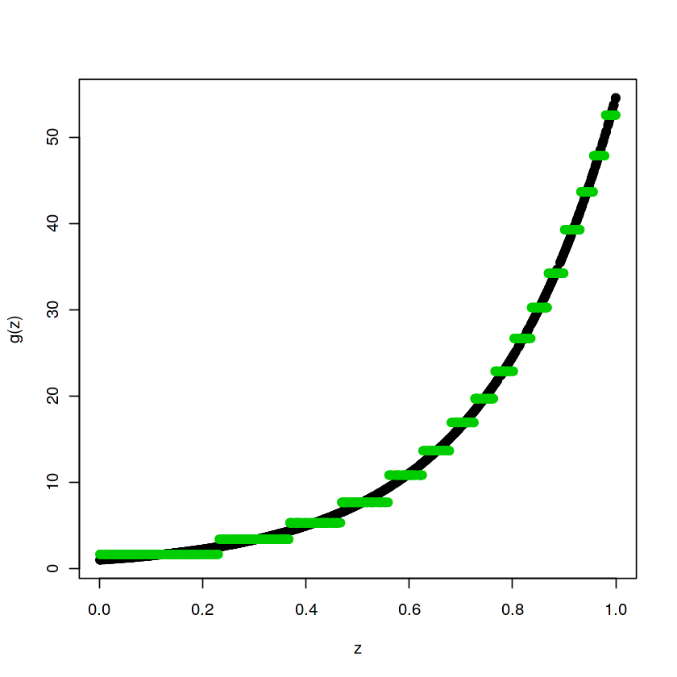{#fig-deep}

## Bagging

- To produce different trees using only the observed data, the trees going into a random forest are grown from artificial data generated by sampling randomly with replacement from the original data; that is, each tree in a random forest is fit to a bootstrap sample. 

- Within the bootstrap samples, trees are grown deep to keep approximation error low. 

- Averaging across the trees produced in the bootstrap samples is then meant to reduce the noisiness of the individual trees. 

- The procedure of averaging noisy prediction rules over bootstrap samples is called Bootstrap Aggregation or *Bagging*. 

- When the data set is large, we can also rely on fitting trees within subsamples instead of using the bootstrap. Using subsamples offers some computational advantages and also simplifies theoretical analysis.

## Bootstrap Samples

- Each bootstrap sample is created by sampling from our data on pairs $(Y_i,Z_i)$ randomly, with replacement. 

- Hence, some observations are drawn multiple times and some aren't redrawn at all.

- Given a bootstrap sample, indexed by $b$, we build a tree-based prediction rule $\hat g_b(Z)$. 

- We repeat the procedure $B$ times in total, and then average the prediction rules that result from each of the bootstrap samples:
$$
\hat g_{\mathrm{random \ forest}} (Z) = \frac{1}{B} \sum_{b=1}^B \hat g_b(Z).
$$

------------------------------------------------------------------------ 

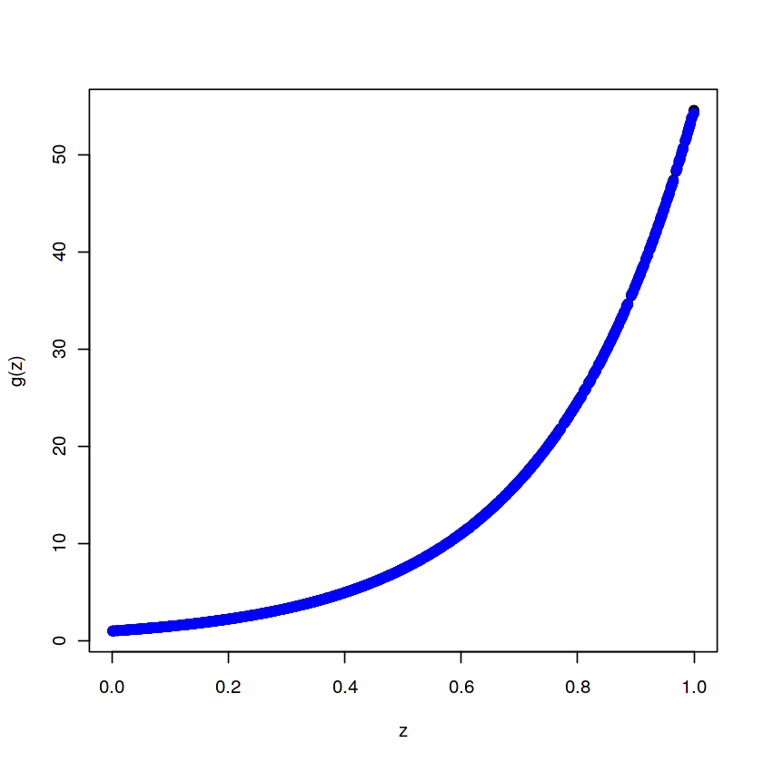{#fig-rf}

------------------------------------------------------------------------

- If we could have many independent copies of the data, we could obtain low-bias but potentially very noisy prediction rules in each copy of the data and then average the prediction rules obtained over these copies to reduce the noise. 

- Since we don't have many copies in reality, we rely on the bootstrap to create many quasi-copies of the data. Another feature of this idea is that the cut-points defining partitions for the tree obtained within each bootstrap sample will be different, producing a different step function approximation.

- Averaging over many step functions with steps at different locations will potentially produce a much smoother approximation to the underlying function. The improved approximation relative to simple trees is illustrated in @fig-rf.

- The most important modification of the simple version of bootstrap aggregation is the use of additional randomization to "decorrelate" the trees: When we build trees over different bootstrap samples, we also randomize over the variables that trees are allowed to use in forming partitions. This additional layer of randomization results in trees having different structure.

## Boosted Trees

- The idea of boosting is that of a recursive fitting: We estimate a simple prediction rule, then take the residuals and estimate another simple prediction rule for these residuals, and so on. A sum of the prediction rules for the residuals then gives us the prediction rule for the outcome. 

- A common use of boosting is with regression trees. Here we use shallow trees as the simple prediction rule. Shallow trees produce low noise prediction rules, but also tend to have high approximation error. 

- However, each step where a model is fit to the residuals from the previous step reduces the approximation error. In order to avoid overfitting, we can stop the procedure once there is no marginal improvement to the cross-validated MSE. T

- The improved approximation of boosted trees relative to simple trees is illustrated in the following @fig-bt.

------------------------------------------------------------------------ 

{#fig-bt}

## The Boosting Algorithm

1. Initialize the residuals: $R_i := Y_i, i=1,...,n$.
2. For $j=1,...,J$, fit a tree-based prediction rule $\hat g_j(Z)$ to the data $(Z_i, R_i)_{i=1}^n$ and update the residuals $R_i := R_i - \lambda \hat g_j(Z_i)$, where
$\lambda$ is called the learning rate.

3. Output the boosted prediction rule:
$$
 \hat g(Z) := \sum_{j=1}^J  \lambda \hat g_j(Z).
$$

------------------------------------------------------------------------ 

- In practice, using boosted trees requires making several choices. One needs to define the tree-based prediction rule used at each step and also choose the number of learning steps, $J$, and the learning rate, $\lambda$. 

- These tuning parameters can be chosen by cross-validation. A default value for $\lambda$ is $0.1$, $0<\lambda<1$. 

- The idea is to fit simple prediction rules, so one will typically specify the prediction rule by setting the depth of the trees to a small number. For example, at each step, the prediction rule may be a regression tree of depth two.

- Note that the boosting algorithm is quite general and can be applied to non-tree uses, see, e.g., @KUECK2023714 for so-called $L_2$-boosting using ols as a simple prediction rule.

- A very popular implementation widely used in industry is *xgboost*, which has the capability to impose qualitative shape constraints like monotonicity in one or several variables.

## Prediction Quality of Modern Nonlinear Regression Methods

- The  best prediction rule for an outcome $Y$ using features/regressors $Z$ is the function $g(Z)$,
equal to the conditional expectation
of $Y$ using $Z$: 
$$
g(Z) = \mathbb{E}[Y \mid Z].
$$

- Theoretical work demonstrates that under appropriate regularity conditions and with appropriate choices of tuning parameters, the mean squared approximation error of prediction rules produced by modern nonlinear regression methods is small once the sample size $n$ is sufficiently large, namely,
$$
\| \hat g- g\|_{L^2(Z)}  = \sqrt{\mathbb{E}_Z[( \hat g(Z) - g(Z))^2 ]} \to 0, \quad \text{ as } n \to \infty,
$$
where $\mathbb{E}_Z$ denotes the expectation taken over $Z$, holding everything else fixed (see e.g in @wager:athey and @syrgkanis:2020).

## When do neural nets win?

- In a recent example, @Bajari-hedonic are interested in predicting prices of products given their characteristics, which include both text and images. 

- In this example, neural networks (specifically BERT and ResNet50) are first used to convert the text and image data into  several thousand-dimensional numerical features $X$ (called embeddings).

- These features extracted from the text and image data are then used as input variables in a deep neural network for predicting product prices. The deep neural network used in the example consists of 3 hidden layers, with the penultimate layer consisting of about 400 neurons.

- The data set used in this example is larger than **10 million observations**. The accuracy of prediction for the deep neural network described above, as measured by the $R^2$ on the test sample, is about $90\%$. 

------------------------------------------------------------------------ 

- In contrast, random forests applied to predict prices using the text and image embeddings as inputs deliver an $R^2$ in the test sample that is in the ballpark of $80\%$, and a linear model estimated via least squares that uses the text and image embeddings as predictor variables delivers an $R^2$ in the test sample of only around $70\%$. 

- Ignoring the neural network embeddings of the text and image data and using only simple catalog features, the $R^2$ is lower than $40\%$.

##  Trust but Verify

- Both tree-based methods and neural networks provide powerful, flexible models that can deliver high-quality approximations of regression functions. However, the high degree of flexibility can lead to overfitting.  Therefore, it is always important to verify the performance on test data to make sure that the predictive model being used is actually a good one.

- A simple verification procedure is data splitting, which can be performed in the following way:

1. We use a random subset of  data for estimating/training the prediction rule. 

2. We use the other part of the data to evaluate the quality of the prediction rule, recording out-of-sample mean squared error, $R^2$, or some other desired measure of prediction quality.

- Recall that the part of the data used for estimation is called the training sample.  The part of the data used for evaluation is called the testing or validation/test sample.

## Combining Predictions - Ensemble Learning

- Given different prediction rules, we can choose either a single method or an aggregation of several methods as our prediction approach. An aggregated prediction ("ensemble") is a linear combination of the basic predictors.

- Specifically,  we consider an aggregated prediction rule of the form:
$$\tilde g(Z) = \sum_{k=1}^K  \tilde \alpha_k \hat g_k(Z),$$ where $\hat g_k$'s denote basic predictors, potentially including a constant. The basic predictors are computed on the training data.

------------------------------------------------------------------------ 

- If the number of prediction rules, $K$, is small, we can figure out the coefficients of the optimal linear combination of the rules, $\tilde \alpha_k$, using test data $V$ by simply running least squares of the outcomes in the test data on their associated predicted values:
$$
  \min_{(\alpha_k)_{k=1}^K} \sum_{i \in V}  (Y_i - \sum_{k=1}^K \alpha_k \hat{g}_k(Z_i))^2.
$$

- Here we are minimizing the sum of squared prediction errors in the test sample using the prediction rules from the training sample as the regressors. If we wish to evaluate the predictive performance, we need a third validation sample.

- If $K$ is large, we can instead use Lasso for aggregation: 

$$
  \min_{(\alpha_k)_{k=1}^K} \sum_{i \in V}  (Y_i - \sum_{k=1}^K \alpha_k \hat{g}_k(Z_i))^2 + \lambda \sum_{k=1}^K | \alpha_k|.
$$

## Auto ML Frameworks

- There are a variety of new frameworks emerging that do automated search and aggregation of different prediction methods. These automatic aggregation procedures use approaches like the one we outlined above or other heuristics. Examples of automatic aggregation methods include H20, AutoML (@ledell2020h2o), and Auto Gluon (@erickson2020autogluon), which relies on Neural Nets. 

## Cross-Validation

- Cross-validation is a common practical tool that
provides a way to choose tuning parameters
such as the penalty level.  The idea of cross-validation is to rely on repeated splitting
of the training data to estimate the potential out-of-sample predictive performance.

**Cross-Validation in Words:**

1. We partition the data into $K$ blocks called "folds", for example, with $K=5$, we split the data into 5 non-overlapping blocks.

 
2. Leave one block out. Fit a prediction rule on all the other blocks. Predict the outcome observations in the left out block, and record the empirical Mean Squared Prediction Error.  Repeat this for each block.

 
3. Average the empirical Mean Squared Prediction Errors over blocks.

We do these steps for several or many values of the tuning parameters and choose the value of the tuning parameter that minimizes the Averaged Mean Squared Prediction Error.

## Cross-Validation: Formal Description

1. Randomly select a partition of observation indices $1,...., n$ in $K$ random folds $B_1,..., B_K$.
 
2. For each $k =1,...,K$, fit a prediction rule denoted by $\hat f^{[-k]}(\cdot; \theta)$, where
$\theta$ denotes the tuning parameters and
 $\hat f^{[-k]}$ depends only on observations **not** in the fold
$B_k$.

3.For each $k=1,...,K$, the empirical out-of-sample MSE for the block $B_k$ is 
  $$
  \text{MSE}_k(\theta) = \frac{1}{m_k} \sum_{i \in B_k} (Y_i -  \hat f^{[-k]}(X_i; \theta))^2,
$$ where $m_k$ is the size of the block $B_k$. 
  

4. Compute the cross-validated MSE as 
$\text{CV-MSE}(\theta) = \frac{1}{K} \sum_{k=1}^K \text{MSE}_k (\theta)$. 
Choose the tuning parameter $\hat \theta$  as a minimizer of $\text{CV-MSE}(\theta)$.

## Notebooks

- [R Notebook on Penalized Regressions](https://drive.google.com/file/d/1Q-Y8kCxAgNc7_OMIPeP1Al1tIf4EKJaf/view?usp=sharing)
provides details of implementation
of different penalized regression methods and examines their performance for approximating regression functions in a simulation experiment.

- [R Notebook on ML-based Prediction of Wages](https://drive.google.com/file/d/1JZvv_jRcivKMa8wtH1kpa73rxSEiezn6/view?usp=sharing) provides details of implementation of penalized regression, regression trees, random forest and boosted tree  methods, a comparison of various methods and a way to choose the best method or create an ensemble of methods.

-  [R Notebook on AutoML Prediction of Wages](https://drive.google.com/file/d/19BXAPM6a6SHqmFuxTo18dDb2fW6Oto5x/view?usp=sharing) provides an application of the H20 AutoML framework to the wage prediction problem.

## Bibliography
 

