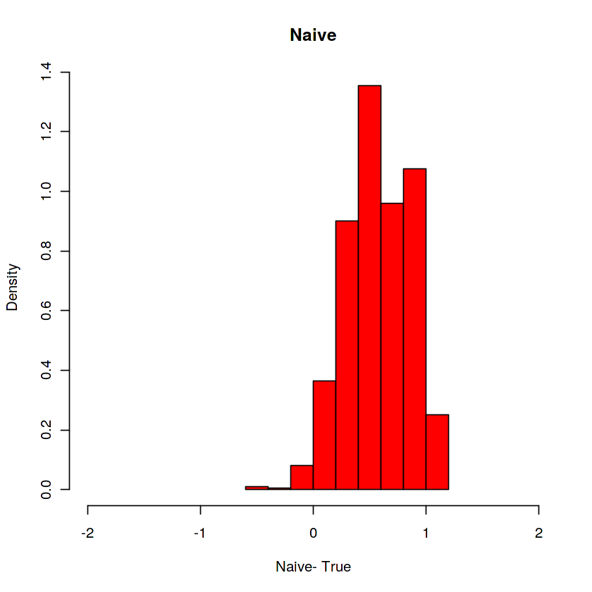
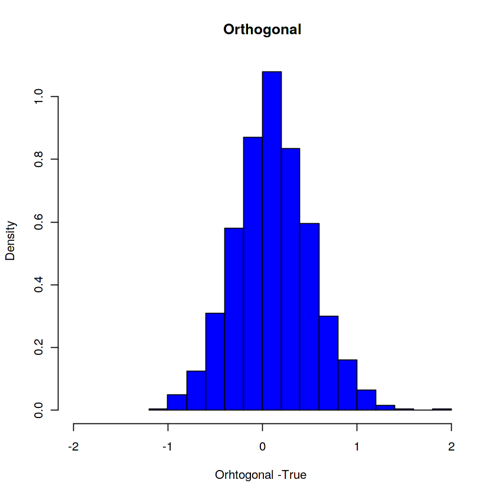

# Statistical Inference on Predictive and Causal Effects in High Dimensional Linear Regression Models

## Introduction

-   We recall the predictive effect question: How does the predicted
    value of $Y$ change if a regressor $D$ increases by a unit, while
    other regressors $W$ remain unchanged?

-   As before, we denote the set of regressors as $X=(D,W)$. In Lecture
    1, we discussed how we could use the population regression
    coefficient corresponding to the variable $D$, denoted $\alpha$, to
    answer this question.

-   Now we turn to estimation and construction of confidence intervals
    for $\alpha$ in the high-dimensional setting.

-   Here we focus on using Lasso methods first.

## Causal interpretation of predictive effects

-   The predictive effect question may have a causal interpretation
    within any model where conditioning on $W$ is sufficient for
    identification of the structural/causal effect of $D$ on $Y$.

-   If conditioning on $W$ is sufficient for identification of the
    causal effect of $D$ on $Y$, the predictive effect question becomes
    a causal effect question: How does the predicted value of $Y$ change
    if we **intervene** and increase $D$ by a unit, holding $W$ fixed?

## Inference with Double Lasso

-   The key to inference will be the application of Frisch-Waugh-Lovell
    partialling-out. Consider the simple predictive model: $$
    Y = \alpha D  + \beta' W + \epsilon,
    $$ where $D$ is the target regressor and $W$ consists of $p$
    controls. After partialling-out $W$, $$
    \tilde Y = \alpha \tilde D +  \epsilon, \quad \mathbb{E}\epsilon \tilde D = 0,
    $$ where the variables with tildes are residuals retrieved from
    taking out the linear effect of $W$ (practically, via linear
    regression)

$$
\tilde Y = Y - \gamma_{YW}'W, \quad \gamma_{YW} = \arg\min_{\gamma \in \mathbb{R}^p} \mathbb{E}[(Y - \gamma'W)^2],
$$ $$
\tilde D = D - \gamma_{DW}'W, \quad \gamma_{DW} = \arg\min_{\gamma \in \mathbb{R}^p} \mathbb{E}[(D - \gamma'W)^2].
$$

------------------------------------------------------------------------

-   The target parameter $\alpha$ can then be recovered from population
    linear regression of $\tilde Y$ on $\tilde D$: $$
    \alpha = \arg\min_{a \in \mathbb{R}} \mathbb{E}[(\tilde Y - a \tilde D)^2] =  (\mathbb{E}[\tilde D^2)^{-1}] \mathbb{E}[\tilde D \tilde Y].
    $$

-   Note also that $a =\alpha$ solves the moment equation: $$
     \mathbb{E}[\tilde Y - a \tilde D) \tilde D] =0.
    $$

-   We now consider estimation of $\alpha$ in a high-dimensional
    setting. For estimation purposes, we maintain that we have a random
    sample $(Y_i, X_i)_{i=1}^n$.

-   To estimate $\alpha$, we will mimic the partialling-out procedure in
    the population in the sample. In Lecture 1, where $p/n$ was small,
    we employed ordinary least squares as the prediction method in the
    partialling-out steps. We are now considering cases where $p/n$ is
    not small, and we instead employ Lasso-based methods in the
    partialling-out steps.

## The Double Lasso

The estimation procedure for a target parameter $\alpha$ in a
high-dimensional linear model setting can be summarized as follows:

1.  We run Lasso regressions of $Y_i$ on $W_i$ and $D_i$ on $W_i$:
    $$\quad \hat \gamma_{YW} = \arg\min_{\gamma \in \mathbb{R}^p}  \quad \sum_i (Y_i - \gamma'W_i)^2 + \lambda_1 \sum_{j}  \hat \psi_j | \gamma_j|,
    $$
    $$\quad \hat \gamma_{DW} = \arg\min_{\gamma \in \mathbb{R}^p}  \quad \sum_i (D_i - \gamma'W_i)^2 + \lambda_2 \sum_{j}  \hat \psi_j  | \gamma_j|,
    $$ and obtain the resulting residuals: $$
    \check Y_i = Y_i - \hat \gamma_{YW}'W_i,$$ $$
    \check D_i = D_i - \hat \gamma_{DW}'W_i.$$ In place of Lasso, we can
    use Post-Lasso or other Lasso relatives.

------------------------------------------------------------------------

2.  We run the least squares regression of $\check Y_i$ on $\check D_i$
    to obtain the estimator $\check \alpha$: $$
    \begin{align*}
    \check{\alpha}&= \arg\min_{a  \in \mathbb{R}} \mathbb{E}_n (\check Y_i - a \check D_i)^2 \\
    &= (\mathbb{E}_n \check D^2_i)^{-1} \mathbb{E}_n \check D_i \check Y_i.
    \end{align*}
    $$

-   We can use standard results from this regression, ignoring that the
    input variables were previously estimated, to perform inference
    about the predictive effect, $\alpha$.

-   Good performance of the Double Lasso procedure relies on approximate
    sparsity of the population regression coefficients $\gamma_{YW}$ and
    $\gamma_{DW}$.

## Adaptive Inference with Double Lasso

::: {#thm-doublelasso}
Under the stated approximate sparsity and additional regularity
conditions, the estimation error in $\check D_i$ and $\check Y_i$ has no
first order effect on $\check \alpha$, and\
$$
\sqrt{n} (\check \alpha -\alpha) \approx  \sqrt{n} \mathbb{E}_n \tilde D\epsilon/ \mathbb{E}_n \tilde D^2   \overset{{\mathrm{D}}}{\rightarrow}   N(0,  V),
$$ where $$
V = (\mathbb{E}\tilde D^2)^{-1} \mathbb{E} ( \tilde D^2 \epsilon^2)  (\mathbb{E}  \tilde D^2)^{-1}.
$$
:::

------------------------------------------------------------------------

-   This statement means that $\check \alpha$ concentrates in a
    $\sqrt{V/n}$- neighborhood of $\alpha$, with deviations controlled
    by the normal law. Observe that the approximate behavior of the
    double lasso estimator is the same as the approximate behavior of
    the least squares estimator in low-dimensional models; see Lecture 1.
    
-   Just like in the low-dimensional case, we can use these results to
    construct a confidence interval for $\alpha$. The standard error of
    $\check \alpha$ is $$\sqrt{\hat V/n},$$ where $\hat V$ is a plug-in
    estimator of $V$. The result implies, for example, that the interval
    $$
    [\check \alpha \pm 2 \sqrt{\hat V/n}]
    $$ covers $\alpha$ about $95\%$ of the time.

## Application to Testing the Convergence Hypothesis

-   We provide an empirical example of partialling-out with Lasso to
    estimate the regression coefficient $\alpha$ in the high-dimensional
    linear regression model: $$
    Y = \alpha D +  \beta'W + \epsilon.
    $$

-   In this example, we are interested in how economic growth rates
    ($Y$) are related to the initial wealth levels in each country ($D$)
    controlling for a country's institutional, educational, and other
    similar characteristics ($W$).

-   The relationship is captured by $\alpha$, the "speed of
    convergence/divergence", which predicts the speed at which poor
    countries catch up $(\alpha< 0)$ or fall behind $(\alpha> 0)$ rich
    countries, after controlling for $W$.

------------------------------------------------------------------------

-   Our inference question here is do poor countries grow faster than
    rich countries, controlling for educational and other
    characteristics?

-   In other words, is the speed of convergence negative: $\alpha<0?$
    This is the Convergence Hypothesis predicted by the Solow growth
    model (Robert M. Solow is a world-renowned MIT economist who won the
    Nobel Prize in Economics in 1987).

-   Under some **strong assumptions** that we won't state here, the
    predictive exercise we are doing can be given causal interpretation.

## Data

-   The outcome ($Y$) is the realized annual growth rate of a country's
    wealth (Gross Domestic Product per capita).

-   The target regressor ($D$) is the initial level of the country's
    wealth.

-   The controls ($W$) include measures of education levels, quality of
    institutions, trade openness, and political stability in the
    country.

-   The sample contains $90$ countries and about $60$ controls.

-   Thus $p \approx 60, n=90$ and $p/n$ is not small.

-   We expect the least squares method to provide a poor/ noisy estimate
    of $\alpha$. We expect the method based on partialling-out with
    Lasso to provide a high-quality estimate of $\alpha$.

## Results

|              | Estimate | Std. Error | $95\%$ - CI        |
|--------------|----------|------------|--------------------|
| OLS          | -0.009   | 0.030      | \[-0.071, 0.052\]  |
| Double Lasso | -0.050   | 0.014      | \[-0.078, -0.022\] |

-   Least squares provides a rather noisy estimate of the speed of
    convergence $\alpha$ which does not allow drawing strong conclusions
    about the convergence hypothesis.

-   For example, the 95% confidence interval is very wide and includes
    both positive and negative values.

-   In sharp contrast, Double Lasso provides a precise estimate. The
    lasso-based point estimate is $-5\%$ and the $95 \%$ confidence
    interval for the (annual) rate of convergence is $-7.8\%$ to
    $-2.2\%$. This empirical evidence is consistent with the conditional
    convergence hypothesis.
    
- The corresponding notebook of the empirical analysis can be found [here](https://drive.google.com/file/d/1HOhouxT9joDw0kthmnKtJYoppT_gDex3/view?usp=sharing).

## Inference on Many Coefficients

-   If we are interested in more than one coefficient, we can repeat the
    one-by-one Double Lasso procedure for each of the coefficients of
    interest and obtain valid estimation and inference on each component
    under regularity conditions.

-   Here we consider the model

$$
Y =  \sum_{\ell=1}^{p_1} \alpha_{\ell} D_{\ell}
+ \sum_{j=1}^{p_2} 
\beta_j \bar W_{j}  + \epsilon,
$$ where the number of interesting predictors $p_1$ could be very large
and the number of controls $p_2$ could also be very large.

## Motivation of this model

There are at least three motivations for considering many coefficients
of interest:

. . .

1.  there can be multiple policies whose predictive effect we would like
    to infer

. . .

2.  we can be interested in heterogeneous predictive effects across
    groups

. . .

3.  we can be interested in nonlinear effects of policies

------------------------------------------------------------------------

-   The methodology can be used to study **heterogeneous effects**,
    where $D_{\ell}'s$ are generated as $$
    D_{\ell} = D_0 \bar X_{\ell}, \quad \ell=1,...,p_1,
    $$ where $D_0$ is the base variable of interest (a treatment
    indicator, price, group indicator), and $(\bar X_l)_{l=1}^{p_1}$ are
    known transformations of controls $\bar W$, for example various
    subgroup indicators.

-   The methodology can also be used to study **nonlinear effects**. For
    example, we could consider $D_\ell$'s generated as polynomial
    transformations of the base treatment variable: $$
    D_{\ell} = D_0^\ell, \quad \ell =1,..., p_1.
    $$ We could also further interact these transformations with other
    variables to study nonlinear heterogeneous effects.

## One by One Double Lasso

-   For each $\ell=1, ..., p_1$, we apply the one-by-one Double Lasso
    procedure for estimation and inference on the coefficient
    $\alpha_\ell$ in the model $$
    Y = \alpha_l D_\ell +  \gamma_\ell ' W_\ell + \epsilon, \quad W_\ell = ( (D_k)_{k \neq \ell}', \bar W')'.
    $$

-   Under approximate sparsity conditions, the Double Lasso method
    provides a high-quality estimate
    $\hat \alpha = (\hat \alpha_\ell)_{\ell=1}^{p_1}$ of
    $\alpha = (\alpha_\ell)_{\ell=1}^{p_1}$ and we can construct
    individual confidence intervals, or even joint confidence bands.

-   Under regularity conditions, this allows for simultaneous inference
    on $p_1>n$ coefficients. **What does simultaneous inference mean?**

## Double Lasso for Many Coefficients

::: {#thm-dlmc}
Under regularity conditions that impose approximate sparsity in all
partialling out steps we have that uniformly in $\ell =1,..., p_1$: $$
\sqrt{n}(\hat \alpha_\ell - \alpha_\ell) \approx (\mathbb{E}_n[\tilde D^2_\ell])^{-1}  \sqrt{n} \mathbb{E}_n[\tilde D_\ell \epsilon],
$$ where the approximation holds in the supremum distance. Further, if
$(\log p_1)^5/n$ is small, we have that $$
\sqrt{n}(\hat \alpha - \alpha) \overset{{\mathrm{D}}}{\rightarrow} N(0, V), 
$$ where $$
V_{\ell k} = (\mathbb{E}[\tilde D^2_\ell])^{-1}  \mathbb{E}[\tilde D_{\ell} \tilde D_k \epsilon^2](\mathbb{E}\tilde D^2_k)^{-1}.
$$
:::

------------------------------------------------------------------------

-   The latter result allows the construction of simultaneous confidence
    bands on all target parameters $\alpha_\ell$'s of the form: $$
    CR = \times_{\ell=1}^{p_1} \left [\hat \alpha_\ell \pm c  \sqrt{\hat V_{\ell \ell}/n} \right ],
    $$ with critical value $c$ chosen so that $$
    \Pr (\alpha \in CR)
    \approx 1-\mathsf{a}
    $$ where $1-\mathsf{a}$ denotes the confidence level.

## Discovering Heterogeneity in the Wage Pay Gap Analysis

-   We apply the method of the preceding section to analyze
    heterogeneity of the wage pay gap using CPS 2012 data.

-   To explore heterogeneity, we interact the female indicator with
    group indicators capturing marital status, education groups,
    geographical regions, and a third degree polynomial in experience.

-   The following tables provide estimated coefficients, standard
    errors, pointwise p-values and the simultaneous $90\%$ confidence
    band for the heterogeneous effects.

-   Among other things, we see that being married predict a larger drop
    in wages for women, controlling for all other characteristics.
    
- The notebook can be found [here](https://drive.google.com/file/d/1ZRQzyXLbl7f1oksqIThVeeA_DJuBc4BC/view?usp=sharing).

## Results

```{=html}
<style>
table {
  font-size: 65%;
}
</style>
```
|                     | Estimate. | Std. Error | p-value |
|---------------------|-----------|------------|---------|
| female              | -0.15     | 0.05       | 0.00    |
| female:widowed      | 0.14      | 0.09       | 0.13    |
| female:divorced     | 0.14      | 0.02       | 0.00    |
| female:separated    | 0.02      | 0.05       | 0.66    |
| female:nevermarried | 0.19      | 0.02       | 0.00    |
| female:hsd08        | 0.03      | 0.12       | 0.82    |
| female:hsd911       | -0.12     | 0.05       | 0.02    |
| female:hsg          | -0.01     | 0.02       | 0.50    |
| female:cg           | 0.01      | 0.02       | 0.58    |
| female:ad           | -0.03     | 0.02       | 0.16    |
| female:mw           | -0.00     | 0.02       | 0.96    |
| female:so           | -0.01     | 0.02       | 0.67    |
| female:we           | -0.00     | 0.02       | 0.84    |
| female:exp1         | 0.00      | 0.01       | 0.53    |
| female:exp2         | -0.16     | 0.05       | 0.00    |
| female:exp3         | 0.04      | 0.01       | 0.00    |

```{=html}
<style>
table {
  font-size: 65%;
}
</style>
```
## Simultaneous $90\%$ Confidence Intervals

|                     | 5%    | 95%   |
|---------------------|-------|-------|
| female              | -0.29 | -0.02 |
| female:widowed      | -0.12 | 0.39  |
| female:divorced     | 0.08  | 0.20  |
| female:separated    | -0.11 | 0.15  |
| female:nevermarried | 0.13  | 0.24  |
| female:hsd08        | -0.35 | 0.41  |
| female:hsd911       | -0.26 | 0.02  |
| female:hsg          | -0.06 | 0.04  |
| female:cg           | -0.04 | 0.06  |
| female:ad           | -0.09 | 0.03  |
| female:mw           | -0.05 | 0.05  |
| female:so           | -0.06 | 0.04  |
| female:we           | -0.06 | 0.05  |
| female:exp1         | -0.02 | 0.03  |
| female:exp2         | -0.28 | -0.04 |
| female:exp3         | 0.02  | 0.06  |

## Why Partialling-out works: Neyman Orthogonality

-   In the double lasso approach, $\alpha$ is the target parameter and
    $\eta$ are *nuisance* parameters with true value
    $$\eta^o= (\gamma_{DW}', \gamma_{YW}')'.$$

-   As the learned value of $\alpha$ depends on the values of the
    nuisance parameters, it is useful to explicitly consider the
    dependence of $\alpha$ on the nuisance parameters: $\alpha(\eta)$.

-   The main idea of the double lasso approach is that it provides a
    procedure for learning the target parameter $\alpha$ that is
    first-order insensitive to local perturbations of the nuisance
    parameters around their true values, $\eta^o$: $$
    \mathsf{D}= \partial_\eta \alpha(\eta^o) = 0.
    $$

-   We will call local insensitivity of target parameters to nuisance
    parameters *Neyman orthogonality*.

------------------------------------------------------------------------

-   Neyman orthogonality is important for providing high-quality
    estimation and inference, especially in high-dimensional settings.

-   In high-dimensional settings, we use regularization procedures to
    estimate the nuisance parameters as solutions to suitable prediction
    problems.

-   The use of regularization generally results in bias, and we may
    heuristically view using regularized estimates of nuisance
    parameters as plugging in estimates of these parameters that are
    close to, but not exactly equal to, the true values of the nuisance
    parameters $\eta^o$.

-   Neyman orthogonality, which guarantees that the target parameter is
    locally insensitive to perturbations of the nuisance parameters
    around their true values, then ensures that this bias does not
    transmit to the estimation of the target parameter, at least to the
    first order.

## Moment conditions

-   The parameter of interest $\alpha$ that depends on nuisance
    parameters $\eta$ with true value $\eta^o$ is Neyman Orthogonal with
    respect to these parameters if $$
    \mathsf{D}= \partial_\eta \alpha(\eta^o) = 0.
    $$

-   If the parameter $\alpha$ is defined as a root in $a$ of the
    equation $\mathsf{M}(a, \eta) =0$, which depends on the nuisance
    parameters $\eta$ with true value $\eta^o$, then the equation is
    Neyman orthogonal if $$
    \partial_\eta \mathsf{M}(\alpha,\eta^o)  =0.
    $$

-   The principle is applicable to problems outside the high-dimensional
    linear model problem considered in this chapter.

## What happens if we don't have Neyman Orthogonality?

-   If we don't have Neyman orthogonality, we should not expect to get
    high-quality estimates of the target parameters.


::: {#exm-naiveselection}

# Single Selection

In this invalid method, one applies Lasso regression of $Y$ on $D$ and $W$ to select relevant covariates
$W_Y$, in addition to the covariate of interest, then refits the model by least squares of $Y$ on $D$ and $W_Y$. Inference for the target parameter is then carried out using conventional inference based on the latter regression.
:::

- Despite its simplicity and seeming intuitive appeal, the approach outlined above is not a valid approach if the goal is to perform inference on $\alpha$. It is a fine approach if the goal is solely prediction of the outcome, but it can result in very misleading conclusions about the parameter of interest $\alpha$, as we demonstrate below. 

---

- The naive approach relies on the moment condition
$$
\mathsf{M}(a, b) = \mathbb{E}[(Y -a D -b'X) D] =0.
$$

- This moment condition is satisfied by the true value, $a = \alpha$ when $b = \beta$, where it coincides with the classical moment condition for $\alpha$ underlying low-dimensional ordinary least squares which sets prediction errors to be orthogonal to each predictor variable.


- However, this moment condition does not exhibit Neyman Orthogonality since
$$
\partial_b \mathsf{M}(\alpha, \beta) =  \mathbb{E}[D X] \neq 0
$$
unless $D$ is orthogonal to $X$.

- Because this moment is not Neyman orthogonal, we would expect that the bias and the relatively slow rate $\sqrt{s \log (p \vee n)/n}$ of convergence of our estimate of $\beta'X$ would transmit to bias and slow convergence in estimates of $\alpha$ provided by solving the empirical analog of the naive moment condition.

## Simulation Study

- We compare the performance of the naive and orthogonal methods in a computational 
experiment where $p = n =100$ and $\beta_j =1/j^2$, $(\gamma_{DW})_j = 1/j^2$, and
$$
\begin{align*}
Y & = 1\cdot D+ \beta'W + \varepsilon_Y,    \ \ 
W \sim N(0, I),  \ \ 
\varepsilon_Y \sim N(0,1)\\
D&= \gamma_{DW}'W +  \tilde D,   \quad  \tilde D \sim N(0,1)/4.
\end{align*}
$$
- From the histrograms shown in the @fig-naive, we see that the naive estimator is heavily biased, as expected from
the lack of Neyman orthogonality in its estimation strategy, while the orthogonal estimator, see @fig-orth, based on partialling out, is approximately unbiased and Gaussian.


## Histograms

{#fig-naive}

---

{#fig-orth}

---

- The reason that the naive estimator does not perform well is that it only selects controls $W_j$' s that are strong predictors
of the outcome, thereby omitting weak predictors of the outcome. However, weak predictors of the outcome could still be strong predictors of $D$, in which case dropping these controls results in a strong **omitted variable bias**. 

- In contrast, the orthogonal approach  solves two prediction problems -- one to predict $Y$ and another to predict $D$ -- and finds controls that are relevant for either.  The resulting residuals are therefore approximately "de-counfounded".

- An shiny app illustrating this problem can be found [here](https://github.com/DoubleML/BasicsDML).

## Double Selection

- One way to fix "single selection" would be to have "double selection":

1. find controls $W_Y$ that predict $Y$ as judged by lasso

2. find controls $W_D$ that predict $D$ as judged by lasso

3. regress $Y$ on $D$ and the union of controls $W_Y \cup W_D$; proceed with standard inference

- This procedure is approximately equivalent to the partialling out approach, and therefore
inherits the orthogonality property.  

- This approach is more conservative compared to single selection, as it
makes sure that we have not omitted controls that are strong confounders for $D$. It therefore guards against
large omitted variable biases.


## Desparsified Lasso

- Yet another procedure that has the orthogonality property and is approximately equivalent to the partialling out approach under suitable conditions
is *desparsified lasso*:

1. Run a lasso estimator of $Y$ on $D$ and $W$, and save the coefficient
estimate $\hat \beta$.

2. Run a lasso estimator of $D$ on $W$ and save the coefficient estimate $\hat \gamma$.

3.  The estimator $\hat \alpha$ is then the solution of the empirical analog of the moment condition above:
$$
\mathbb{E}_n [  (Y  - \hat \alpha D - \hat \beta'W) \tilde D (\hat \gamma)  ]  = 0,
$$
where $\tilde D(\gamma) = D- \gamma' W$.

- Estimators of this form 
are referred to in econometrics as "instrumental variable estimators". In purely technical terms we are using residualized $\tilde D$ to "instrument" for $D$.

## Notebooks

- Notebook on the the [Convergence Hypothesis](https://drive.google.com/file/d/1HOhouxT9joDw0kthmnKtJYoppT_gDex3/view?usp=sharing).