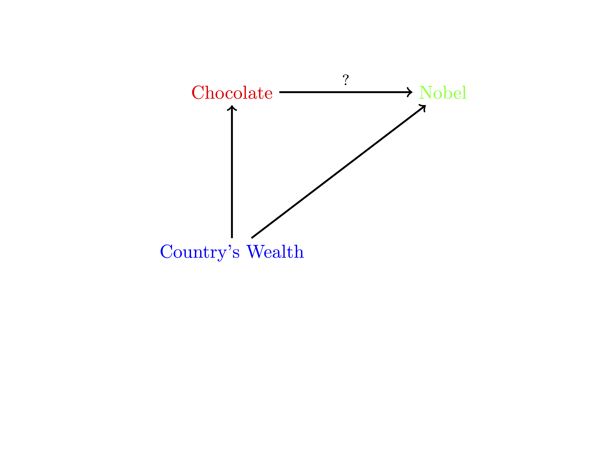
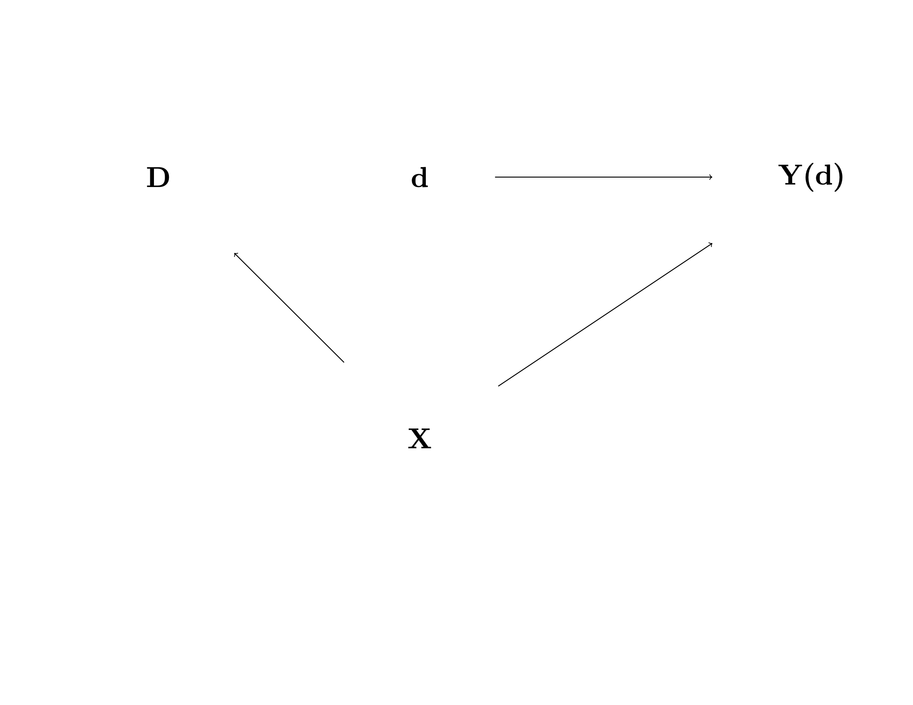

# Causal Inference via Conditional Exogeneity

## Introduction

**"A fancy method alone is not a credible identification strategy"**

-   Here we discuss how average causal effects may be identified using
    regression when treatment is not randomly assigned but instead
    depends on observed covariates.

-   We discuss the regression method, where we compute the average
    difference between expected outcomes for treated and untreated units
    that are comparable (formally, identical) in terms of their
    characteristics $X$.

-   If treatment is as good as randomly assigned conditional on $X$,
    then this approach recovers average causal or treatment effects.

-   This key condition is commonly referred to as conditional
    ignorability or **conditional exogeneity**.

## Example

-   In a cross-country analysis, higher chocolate consumption predicts a
    higher number of Nobel laureates per capita.

{#fig-choclate}

------------------------------------------------------------------------

-   Is this a reflection of a true causal effect and therefore an
    actionable insight?

-   If it were, countries could generate more Nobel laureates per capita
    by making chocolate abundant to everyone. (This wouldn't be a bad
    thing.)

-   Is this perhaps what Switzerland did? Switzerland has the highest
    number of Nobel laureates per capita.

## Common Causes

-   Or is there a common cause that creates non-causal association --
    perhaps wealthy countries invest more in science and higher wealth
    causes people to consume luxury goods like chocolate?

-   Comparative analysis, where we compare nations with identical or
    similar wealth, would probably reveal that the correlation is not
    causal.

-   Probably we should be comparing Switzerland to similar countries in
    terms of wealth -- the "apples-to-apples" comparison, so to
    speak.

-   This type of analysis is very common in causal inference and is
    implemented via a set of tools introduced in this chapter.

---

{width=200%}

---

- In what follows, we work within Rubin's  potential outcomes framework(@rubin74), as introduced in Lecture 2. The idea is that if we can think of observed treatment $D$ as generated randomly -- independently of potential outcomes  --  conditional on some pre-treatment variables $X$, then we can learn the average causal (treatment) effects by regression
$$
\text{ of } \ Y  \text{ on } \  D\ \text{ and  } \  X,
$$
or, as is often said, by "controlling" for $X$.

## Notation

- Recall that we denote the independence of two random variables as $\perp \!\!\! \perp$

Note that $\perp$ that is used to denote orthogonality (uncorrelatedness
of a centered random variable with another)

- If $U$ is centered, then $U\perp \!\!\! \perp V$ implies $U \perp V$, but the reverse
implication is not true in general.

- Independence, conditional on a third variable $X$, is denoted by
$$
U \perp \!\!\! \perp V \mid X.
$$

## Identification by Conditioning

- Recall that we use $Y(d)$ to denote potential  outcome in the treatment state $d$.  

- Suppose we want to study the impact of smoking marijuana on life longevity.

- Suppose that smoking marijuana has no causal/treatment effect on life longevity:
$$
Y = Y(0) = Y(1), \text{ so that } \delta  = \mathbb{E}[Y(1)] - \mathbb{E}[Y(0)] =0.
$$

- However, the observed smoking behavior, $D$, results not from an experimental study, but
from observational data in which an individual's smoking behavior is associated with poor health choices $X$ (drinking alcohol for example) which cause shorter life longevity. 

---

- In this case, the predictive effect recovered by regression without adjusting for $X$ does not match the average causal effect
$$ \mathbb{E}[Y \mid D =1] - \mathbb{E}[Y \mid D=0 ]< 0 = \delta, $$
because higher $D$ predicts higher $X$, which predicts lower $Y$. 

- This difference between the predictive effect and average causal effect is the result of confounding or **selection bias**. 

- In this example, conditioning on $X$ can remove the selection bias
$$
    \mathbb{E}[\mathbb{E}[Y \mid D =1,X] - \mathbb{E} [Y \mid D=0,X ]] = \delta
$$
provided that conditional on $X$ variation in $D$ is independent of the potential health outcomes.

## Conditional Exogeneity

- The following provides a formal assumption under which we can eliminate
the confounding bias by controlling for $X$. 

- **Conditional Ignorability/ Exogeneity:**
 Suppose that treatment status $D$ is independent
of potential outcomes $Y(d)$ conditional
on a set of covariates $X$; that is, for each $d$:
$$
D \perp \!\!\! \perp Y(d) \mid X.
$$
- You may wonder why the term "ignorability" is used.  The distribution of $Y(d)$ depends only on $X$ and not on $D$, so the latter
is "ignorable". 

- Note that the conventional name used in econometrics for the ignorability assumption is **conditional exogeneity**.

---

- We can learn about the causal effect of $D$ by comparing outcomes across treated and control units who have identical characteristics $X=x$ under the conditional exogeneity assumption. 

- The idea of comparing observations who have identical characteristics is the essence of the so-called *conditioning* strategy to learning causal effects. 

- As conditioning approaches produce a different contrast for every potential value of $X$, we may also wish to average the contrasts at different values of $X$ over the distribution of characteristics to produce a summary measure of the causal effects.   

## Overlap/Full Support

- The conditional probability of receiving treatment, *the propensity score*, plays an important role in this approach.

- **Overlap/Full Support:**
The probability
of receiving treatment given $X$, the propensity score $p(X) := \Pr(D=1|X)$, is non-degenerate:
$$
\Pr(0 < p(X) < 1) = 1.
$$
- The overlap assumption requires that there is proper randomization or variation in $D$ at each value $x$ in the support of $X$. 

- Without this condition, there are values $x$ in the support of $X$ where we cannot construct a contrast between treatment and control units. 
- We cannot learn the conditional average treatment effect at these values of $X$ and thus are also unable to learn the unconditional average effect of the treatment.

## Conditioning on $X$ Removes Selection Bias

::: {#thm-conditioning}

Under Conditional Ignorability and Overlap,
the conditional expectation function of observed outcome $Y$ given $D=d$ and $X$ recovers the conditional expectation of the potential outcome $Y(d)$ given $X$: 
$$
\mathbb{E}[Y \mid D=d, X ]= \mathbb{E}[Y(d) \mid D=d, X] = \mathbb{E}[Y(d) \mid X].
$$
:::

- To prove @thm-conditioning, note that the overlap assumption makes it possible to condition on the events $\{D=0, X\}$ and $\{D=1, X\}$ at any value in the support of $X$ and that the second equality holds by conditional exogeneity/ignorability.

---

- Hence, the Conditional Average Predictive Effect (CAPE),
$$
\pi(X) = \mathbb{E}[Y \mid D=1, X] -  \mathbb{E}[Y \mid D=0, X],
$$
is equal to the Conditional Average Treatment Effect (CATE),
$$
\delta(X) = \mathbb{E}[Y(1) \mid X] - \mathbb{E}[Y(0) \mid X ].
$$
Thus, the APE and ATE also agree:
$$
\delta = \mathbb{E}[\delta(X)] = \mathbb{E}[\pi(X)] = \pi.
$$

<!-- ## Consistency -->

<!-- - **Consistency:** Suppose that $Y$ is generated as $Y := Y(D)$. -->

## Conditional Exogeneity via  Causal Diagrams    

- It is possible to illustrate the previous set-up and assumptions graphically as follows:

---

- In this graph, we show the potential outcome $Y(d)$ as a node and the potential treatment status $d$ as another node. The latter node is deterministic.   

- There is an arrow from $d$ to $Y(d)$ indicating the dependency. 

- The pre-treatment covariates $X$
affect both the realized treatment variable $D$ and the potential outcomes $Y(d)$, as shown by the arrow from $X$ to $D$ and from $X$ to $Y(d)$. 

- The assigned treatment variable $D$ is independent of the node $d \mapsto Y(d)$, conditional on $X$,  which is shown by the absence of the arrow between these two nodes.

---

- The potential outcome process $d \mapsto Y(d)$ and treatment assignment jointly determine the realized outcome
variable $Y$ via the assignment $Y := Y(D)$.  This generates the following causal diagram:

---

- This graph says that $X$ is generated first. $D$ is then generated, with the distribution of $D$ depending on $X$. Finally, $Y$ is generated, with its distribution depending on both $D$ and $X$. Here, after conditioning
on $X$, the statistical dependence (association) between $D$ and $Y$ only reflects the causal channel, $D \to Y$ allowing us to uncover the ATE, for example.

## Identification Using Propensity Scores

- The fact that conditioning on the right set of controls removes selection bias has long been recognized by researchers employing regression methods.  Rosenbaum and Rubin \cite{rr-83} made the much more subtle point that conditioning on only the propensity score 
$$
p(X) = \Pr[D=1 \mid X]
$$
also suffices to remove the selection bias.

::: {#thm-prop} 
## Rosenbaum and Rubin: Conditioning on the Propensity Score Removes Selection Bias

Under Exogeneity and Overlap, $D$ is generated independently of $Y(d)$ for each $d$, conditional on
the propensity score $p(X)$: For each $d$,
$$
D \perp \!\!\! \perp Y(d) \mid p(X).
$$
:::

---

- In other words, conditional on $p(X) =p$, variation in $D$ is as good as randomly assigned. This fact makes $p(X)$ a  "minimal sufficient" statistic, conditioning
on which removes selection bias under ignorability. 

- Conditioning on the propensity score rather than $X$ itself is a useful empirical strategy when $X$ is high dimensional and $p(X)$ is available (in stratified RCTs) or can be approximated accurately.

- An interesting example where the propensity score is not known but can be well-approximated is the examination in @angrist2016 of the causal effect of attendance at a particular school or group of schools relative to one or more alternative schools (e.g., "elite" vs. "non-elite" schools) in settings where matching algorithms are used to assign students to schools. In this example, we can think of these student assignment mechanisms as $p(X).$

- In such scenarios, we can simply use $p(X)$ as a control in place of the high dimensional set of characteristics, $X$, and thus bypass a potentially complicated high dimensional estimation problem. 

## Identification by Propensity Score Reweighting

- An alternative approach, known as the Horvitz-Thompson method (@HT), uses propensity score reweighting to recover averages of potential outcomes. 

::: {#thm-horwitz} 
## Horvitz-Thompson: Propensity Score Reweighting Removes Bias

Under Conditional Exogeneity and Overlap, the conditional expectation of an appropriately reweighed observed outcome $Y$, given $X$, identifies the conditional average of potential outcome $Y(d)$ given $X$:
$$
\mathbb{E}[ Y 1(D=d)/\Pr(D=d|X) \mid X ]  =  \mathbb{E} [ Y(d) \mid X ]
$$
Then, averaging over $X$ identifies the average potential outcome:
$$
\mathbb{E} [ Y 1(D=d)/\Pr(D=d|X)  ]  =  \mathbb{E}[ Y(d)  ]
$$
:::

---

- To prove this result, note

$$
\begin{eqnarray*}
&& \quad \mathbb{E}[ Y 1(D=d)/\Pr(D=d|X) \mid X ]  \\
&&=\mathbb{E}[ Y 1(D=d)  \mid X ]/\Pr(D=d|X) \\
&&  = \mathbb{E} [ Y(d) \mid X] \mathbb{E}[1(D=d)\mid X] /\Pr(D=d|X) \\
&&  = \mathbb{E}[Y(d) \mid X], 
\end{eqnarray*}
$$ where we used the conditional ignorability in the second equality.

- As a consequence, we can identify average
treatment effects by simple averaging of transformed outcomes:
$$
\delta = \mathbb{E}[Y H], \quad   H = \frac{ 1(D=1)}{\Pr(D=1|X)}- \frac{1(D=0)}{\Pr(D=0|X) },
$$
where $H$ is called the Horvitz-Thompson transform.

- Note that this reduces to the difference of means in the control and treatment groups when the propensity score is constant.

## Stratified RCTs

-  **Generalized/Stratified RCT:** If under conditional exogeneity and consistency, the propensity score $p(X)$ is known, the setting is called a generalized or stratified RCT.

- In the case, we are essentially back to a classical RCT.

- Propensity score reweighting is generally not the most efficient approach to estimating treatment effects from statistical point of view because it ignores any dependence between the outcomes and controls, $X$, that is not captured by the propensity score. 

- By exploiting dependence between the outcomes and $X$ not captured by the propensity score, more efficient estimation of treatment can occur as using this dependence "de-noises" the outcome.  

- Moreover, estimation based on only propensity score reweighting fails under imbalances that might arise due to imperfect data collection.

## Covariate Balance Checks

- Given a propensity score $p(X)$, which is available in the stratified RCT settings outlined above, we can check if the RCT is valid (randomization is successful) by
performing a **covariate balance check**:
$$
\mathbb{E}[H \mid X] =0.
$$
- In a linear framework, this check can be done by running a regression of $H$ on $W$, a dictionary of transformations of $X$, and testing
if $W$ predicts $H$. $W$ predicting $H$ suggests that the RCTs randomization protocol did not go as planned.

- In the [reemployment experiment](https://drive.google.com/file/d/1oZWXhKgISYtGGhuyvcxhryXHGtkIXcuU/view?usp=sharing), we observed that the balance did not seem satisfied across age groups; specifically, we found more younger workers in the control group. Hence, further controlling for age makes sense and results in modest changes to estimates of the treatment effect.  

- Of course, there is no guarantee that controlling for observed covariates can overcome selection bias in compromised RCTs in general because unobserved covariates may be driving the bias.

## Average Treatment Effect for Groups and on the Treated

- In addition to unconditional average treatment effects (ATE) or average treatment effects at specific values of the covariates $X=x$, we may be interested in average effects within specific subpopulations.

- A leading example of an interesting subpopulation treatment effect is a group ATE (GATE):
$$
\bar \delta = \mathbb{E}[ Y(1) - Y(0) |G=1]
$$
where $G$ is a group indicator defined in terms of $X$'s, such as $G= 1(X \in R)$ where $R$ is a region. 

- For example, we might be interested in the effects of a training program among younger people, say between 18 and 30 years old ($G = 1(18 \leq age \leq 30)$); among  people older than 30 years old (so $G = 1(30 < age)$); and differences between these two groups.

---

- We can immediately obtain the GATE using the identification results above and law of iterated expectations:

$$
\begin{align*}
\mathbb{E}[ Y(1) - Y(0) |G=1] &= \mathbb{E} [\mathbb{E}[Y|D=1,X] - \mathbb{E}[Y|D=0,X]|G=1] \\
&= \mathbb{E}[ H Y |G =1].
\end{align*}
$$

- That is, we can identify GATEs either by taking the difference in regression functions or applying propensity score reweighting of outcomes and then averaging over group $G$.

## Average Treatment Effect on the Treatet

- We next consider treatment effects for the subpopulation of treated units, the *average treatment effect on the treated* (ATET):

$$
\delta_1 = \mathbb{E}[(Y(1) -  Y(0) \mid D = 1].
$$

-  For example, consider training completion as treatment, $D$, and $X$ a vector of pre-treatment variables such that unconfoundedness holds. Consider the  question: 

**How much more do trainees earn on average after going through the training program?**

- The ATET, $\delta_1$, is the parameter that answers such questions about counterfactuals.  The ATET is identified by
$$
\mathbb{E} [\mathbb{E}[Y|D=1,X] - \mathbb{E}[Y|D=0,X] \mid D=1].
$$

## Connection to Linear Regression

- Our tools can be used to perform statistical inference on ATEs. 

- We briefly discuss how (high dimensional) regression can be used to retrieve causal estimates when conditional ignorability/exogeneity holds.

- The simplest instance of the problem is when the conditional expectation function of $Y$ given $D$ and $X$ is linear,
$$
\mathbb{E}[Y \mid D, X] = \alpha D + \beta' W,
$$
which gives a model
$$
Y = \alpha D + \beta'W + \varepsilon, \quad \mathbb{E}[\varepsilon \mid D, X] =0.
$$

- In this model,  $\alpha$ identifies $\delta$, $\delta = \alpha$, under the linearity assumption and exogeneity, and our inference tools for $\alpha$ automatically carry over to $\delta$.

---

- Of course, the assumption of linearity  is restrictive. A simple way to relax this is to consider interactions.  One version of this approach takes all interactions and assumes
$$
\mathbb{E}[Y \mid D, X] = \alpha_1 D + \alpha_2 DW + \beta_1 + \beta' W,
$$
where we also maintain that we are working with centered covariates: $\mathbb{E}[W] = 0$.

- This model is still linear and results for linear models carry over to this case as well.

- We then recover the ATE as $\delta = \alpha_1$
and CATE as
$$
\delta(X) = \alpha_1+ \alpha_2' W.
$$

- We can use partialling out methods, such as OLS in low-dimensional case and Double Lasso (and variants) in high-dimensional case, to perform inference on $\alpha_1$ and components of $\alpha_2$, or even $\beta_1$. 

## What if the propensity score is known?

- When the propensity score $p(X)$ is known, we can include is as part of $W$ in the formulations from the previous section.

- Another useful strategy is to consider regression models where $HY$ is the dependent variable (@duflo):

$$
\mathbb{E}[ HY \mid H, X] = \alpha_1 + \alpha_2'W + \beta_1 H + \beta_2'HW. 
$$

- In this regression model, we recover the ATE as $\delta = \alpha_1$ and CATE as $\delta(X) = \alpha_1+ \alpha_2'W$.

- We can use partialling out methods, such as Double Lasso, to perform inference on $\alpha_1$ and components of $\alpha_2$.  

- We also discuss inference on CATE using more general machine learning methods in later lectures. 

## Bibliography
