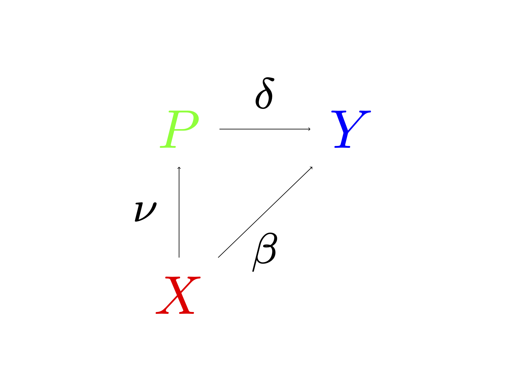
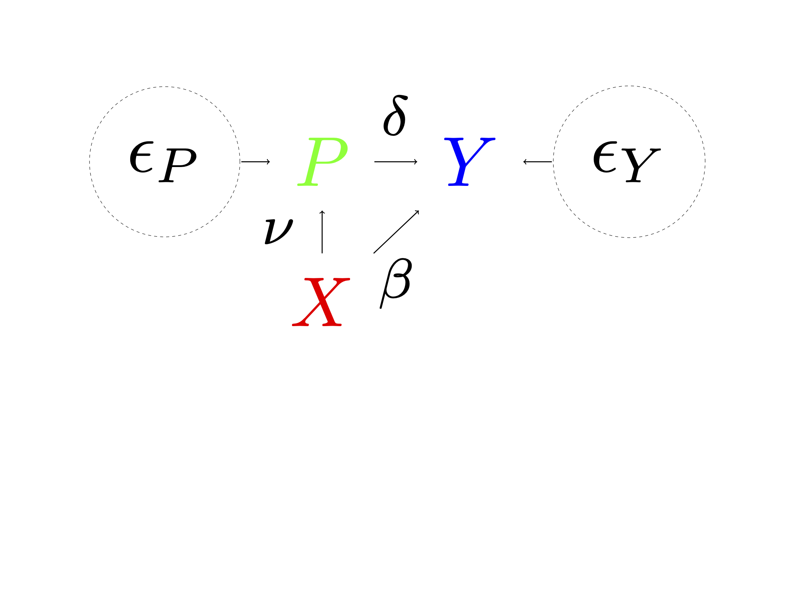
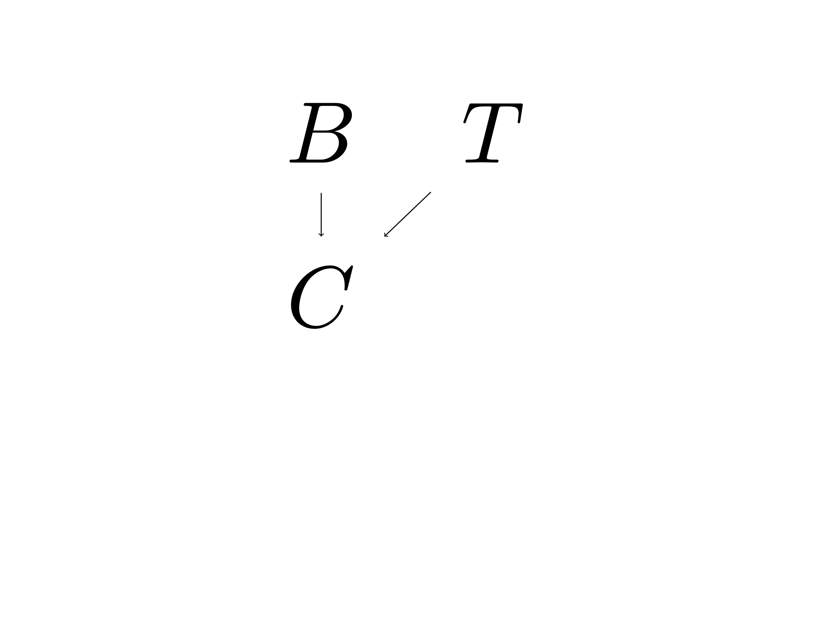
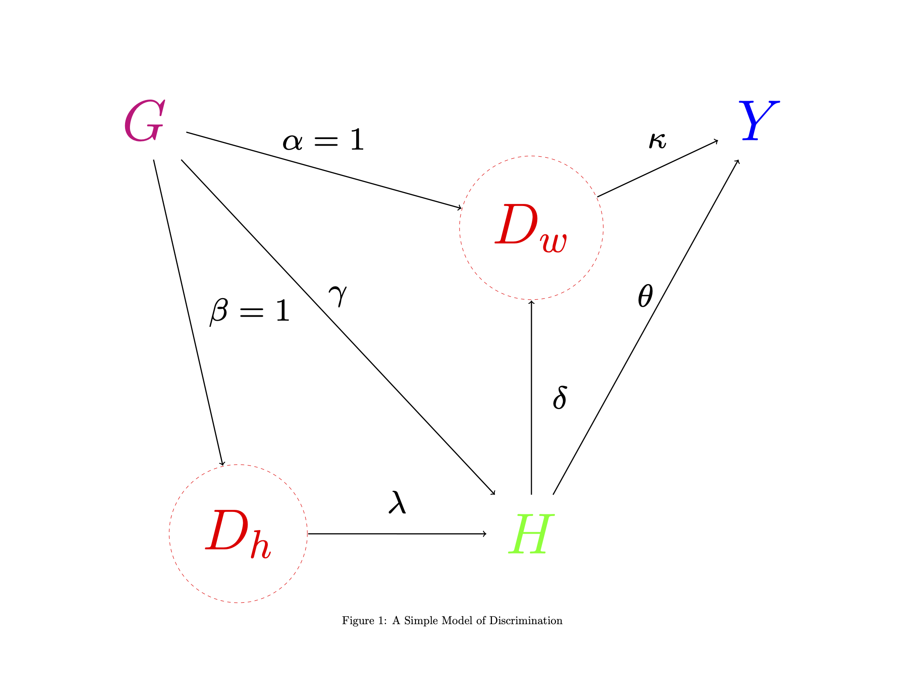

# Causal Inference via Structural Equations

## Introduction

-   Here we present the linear structural equation model framework and causal diagrams.

- The advantage of these models is they can be expressly linked to underlying
structural models in economics and others fields, and they allow for transparent
derivation of conditional exogeneity assumption from the structure of the model.

- While linearity is imposed in this lecture, it will be dispensed with in later lectures.

## Structural Equation Modelling

- We shall illustrate the basic ideas using a simple model of a household's (say weekly) demand
for gasoline, motivated by @hausman:demand.

- We start with a log-linear (@cobb1928) model for log-demand $y$ given the log-price $p$
$$
y(p) := \delta p, 
$$
where $\delta$ is the elasticity of demand.  

- Demand is random across households, and we may model
this randomness as
$$
\begin{align}\label{eq:stylizeddemand}
Y(p):= \delta p + U,  \quad \mathbb{E}[U] = 0,
\end{align}
$$
where $U$ is a stochastic shock that describes variation of demand across households (or across time,
but assume that we are just looking at a particular time point). 

---

- We immediately recognize that $Y(p)$
plays the same role as a potential outcome in Rubin's potential outcome model.

- The stochastic function $$p \mapsto Y(p)$$ describes a household's log-demand at a given log-price $p$. The expected log-demand at log-price $p$
is given by $\mathbb{E}Y(p) = \delta p$.  

- The function encodes various structural causal effects: If we change $p$ from $p_0$ to $p_1$, the expected demand change would be
$$
\mathbb{E}[Y(p_1)] -  \mathbb{E}[Y(p_0)] = \delta(p_1 - p_0).
$$

---

- The model is very simple, and we may want to introduce covariates to capture other observable factors that may be associated with demand:

$$
\begin{equation}\label{eq: lin_str}
Y(p):= \delta p + X'\beta + \epsilon_Y,  \quad \epsilon_Y \perp \!\!\! \perp X.
\end{equation}
$$

- This equation is a structural stochastic model of economic outcomes. This model has nothing to do with regression or a statistical predictive model. Rather, it is a model that provides
counterfactual predictions: If log-price is set to $p$, then a household with characteristics $X$ can be  predicted to purchase
$$
\delta p + X'\beta
$$
log-units.

- Here $p$ is not a random variable -- it is an index describing potential values of the price!

## Question

- What  data  $(Y, P, X)$ on quantities, prices, and characteristics should we collect to  allow us to estimate
the structural parameter $\delta$?

## Assumptions

1. (Consistency) Suppose the observed variables $(Y,P,X)$
are such that  $$Y = Y(P)$$
 i.e. the outcome is generated from the structural model,

2. (Conditional Exogeneity) The observed $P$ is determined outside of the model, independently of $\epsilon_Y$ conditional on $X$:
$$ P \perp \!\!\! \perp \epsilon_Y \mid X  \ \Longrightarrow  P \perp \!\!\! \perp \{ Y(p)\}_{p \in \Bbb{R}} \mid X$$ 
--- 

- This assumption is the econometric analog of ignorability. 

- In the context of household demand, this condition requires that $P$ is determined independently of a household's demand shock $\epsilon_Y$, conditional
on characteristics $X$. 

- This assumption seems plausible for household level decisions, especially if we include geography in the set of covariates $X$.  

- At a general level, gasoline prices are determined by aggregate supply and demand conditions, with small local geographic adjustments (e.g., gasoline
prices in areas with higher prices of land may be higher than in other areas to reflect the higher land costs for gasoline stations). Conditional on being in a given small geographic region, we may think of price fluctuations as independent of household-specific demand shocks. 

## Conclusion

- If the conditional exogeneity condition holds, then $$
Y = Y(P) = \delta P + X'\beta + \epsilon_Y, \quad \epsilon_Y \perp (P, X).
$$

- This means that the projection parameters of $Y$ on $P$ and $X$
coincide with the structural parameters $\delta$ and $\beta$.

- We stress that our parameters $\delta$ and $\beta$ are not defined by regression; they are defined by the model. Under the conditional exogeneity condition, these parameters coincide with the projection parameters.

---

- We might further think that household characteristics are generally determined well before gasoline prices faced by individual households in any specific time period are set.

- Thus, we can postulate a structural equation for log-prices: $$P(x):= x'\nu + \epsilon_P,$$  where $P(x)= P(x_1)$ is the stochastic price process indexed by  a subvector $x_1$ of $x$ (e.g., geographical
characteristic $x_1$), and $\epsilon_P$ describes the centered stochastic price shock. 

- We assume that observed $X$ is independent of price shock $\epsilon_P$,
$$
X \perp \!\!\! \perp  \epsilon_P.
$$

- This independence implies that $\nu$ coincides with the projection coefficient of $P$ on $X$.

## Triangular Structural Equation Model (TSEM)

- Putting the equations together, we have a triangular structural equation model (TSEM):
$$\begin{eqnarray}\label{eq:TSEM}
\begin{array}{lll}
&& Y := \delta P + X'\beta + \epsilon_Y,\\
&& P := X'\nu + \epsilon_P, \\
&& X,
\end{array}
\end{eqnarray}
$$ {#eq-tsem}
where $\epsilon_Y$, $\epsilon_P$, and $X$ are mutually independent (or at least uncorrelated) and determined outside of the model. 

- They are called exogenous variables. $Y$ and $P$ determined within the model and called
the endogenous variables. 

- The structural parameter $\delta$ can be identified by linear regression provided
$Var(\epsilon_P)>0$, and the structural parameter $\nu$ can be identified by linear regression provided $Var(X)>0$.

## What do we mean by the model being structural?

- The term structural means that each
of the equations is **assumed** to provide comparative statics and answers counterfactual questions.  Setting the right-hand-side variables to their potential values, we have
$$
\begin{eqnarray*}
\begin{array}{lll}
 & & Y(p, x)  :=  \delta p+ x'\beta + \epsilon_Y,     \\ 
 && P(x) := x'\nu + \epsilon_P. \\
\end{array}
\end{eqnarray*}
$$
- The conceptual operation of "setting" or "fixing" the variables is supposed to leave the structure invariant.

- More generally, the structural parameters are supposed to be invariant to changes in the distribution of exogenous variables -- $X$,  $\epsilon_Y$, $\epsilon_P$ -- that have been generated
outside of the model. 

- Therefore, we can use these structural parameters to generate counterfactual
predictions. 

## Drawing the Model: Causal Diagrams, aka DAGs

- The system of equations of our TSEM in @eq-tsem can be graphically depicted as the following causal (path) diagram:

---

- The graph represents a structural
economic model that can answer causal (comparative statics) questions.

- For example, the elasticity parameter $\delta$ tells us how household demand will respond to a firm *setting* a new price. Note that a firm setting a new price will not alter household characteristics or the other exogenous features of the model, and thus only the parameter $\delta$ is relevant for answering this question within the model.

- We could have expanded the previous graph to include unobserved shocks $\epsilon_P$ and $\epsilon_Y$.

---

---

- The graph initiates with the *root nodes* $\epsilon_P$, $X$ and $\epsilon_Y$.  

- The absence of links between the root nodes signifies the orthogonality between the nodes: namely, the absence of correlation. This structure
is important because it allows identification of various structural parameters via projection
as noted above.  

- The nodes $X$ and $\epsilon_P$ are *parents* of $P$; the nodes $P, X,$ and $\epsilon_Y$
are *parents* of $Y$. The node $Y$ is a *collider* on all paths, because it contains only incoming arrows. 

- The main effect of interest is $\delta$, which we call the structural causal effect of $P$ on $Y$. This effect is identified after adjusting for $X$.  

-  In terms of the graph above, there are two paths connecting $P$ and $Y$:  $$P \to Y \text{ and  }  P \leftarrow X \to Y.$$ 

- The second path is called a "back-door path" because there is an arrow pointing back to $P$ from $X$. This connection indicates that there is a common cause for $P$ and $Y$. Figuratively speaking, controlling or adjusting for $X$ is said to be like "closing the back-door" path, shutting down the non-casual sources of statistical dependence between $Y$ and $P$.

---

## How do household characteristics impact our model? 

- $X$ affects $Y$ through two paths: 1. the direct effect $\beta$ via $X \to Y$, and 2. the indirect effect $v\delta$ via $X \to P \to Y$. 

- The indirect effect is said to be "mediated" by $P$. We already saw that we can identify $\delta$ and $\beta$ from projection of $Y$ on $P$ and $X$, and we can identify $\nu$ by projection of $P$ on $X$. Therefore both the direct and indirect effects are identified.  

- The total effect of $X$ on $Y$ is $\nu \delta + \beta$
which can be identified in this case by projection of $Y$ on $X$. To verify this,  we plug the first equation from the TSEM in @eq-tsem into the second equation producing
$$
Y = (\nu \delta + \beta)'X + V; \quad V = \epsilon_Y + \delta \epsilon_P.
$$

---

- We see that the composite disturbance $V$ is orthogonal to $X$,
$$
V \perp X,
$$
and, therefore,  $(\nu \delta + \beta)$ coincides with the projection coefficient in  the projection of $Y$ on $X$. The latter point can be seen graphically: There are no "back-door" paths from $X$ to $Y$,
so it is not necessary to adjust or control for anything to identify the total effect of $X$ on $Y$.

- In fact, while conditioning on $P$ would allow us to identify the direct effect of $X$, $\beta$, it would prevent us from retrieving the total effect $\nu \delta + \beta$. In empirical practice, we may think of conditioning on $P$ as "conditioning on the outcome," as $P$ is determined by its parents, including $X$, so may be thought of as an outcome relative to $X$. 

- To retrieve a causal parameter of interest, then, we must first define the causal parameter of interest and then carefully consider the choice of what to condition on to learn this effect. These choices are particularly important given the existence of *collider bias*.

## When Conditioning Can Go Wrong: Collider Bias aka Heckman Selection Bias

- Consider the following SEM: 

\begin{eqnarray}
\begin{split}\label{eq:simSEM}
&T  :=  \epsilon_T \\
& B  :=  \epsilon_B \\
& C :=   T+ B + \epsilon_C,
\end{split}
\end{eqnarray} where, $\epsilon_T, \epsilon_B$, and $\epsilon_C$ are independent $N(0,1)$ shocks.
---

---

- Here, the average structural function for $T$, which does
not depend on what values $B$ might take, is zero,
$$
\mathbb{E}_p [T] = 0.
$$

- Regression without conditioning on $C$ correctly identifies that $T$ is not causally impacted by $B$:

$$
\mathbb{E}_p [T \mid B=b] = 0.
$$

- However, further conditioning on $C$ removes the causal interpretation of the projection coefficient:
$$
\mathbb{E}_p [T \mid B, C] = (C-B)/2    \implies \mathbb{E}_p [ \mathbb{E}_p [T \mid B=b, C] ]  = -b/2 < 0.
$$

---

- This regression suggests that, controlling for $C$, the predictive effect of $B$ on $T$ is $-1/2$. This predictive effect is not a causal effect.

- Collider bias illustrates that conditioning on outcomes may produce the wrong conclusions about causality, so conditioning on outcomes should be always approached with care. 

- In econometrics, collider bias is known as a form of sample selection bias.

- J. Heckman was awarded the [Nobel Memorial prize](https://www.nobelprize.org/prizes/economic-sciences/2000/press-release/) "for his development of theory and methods for analyzing selective samples" , (Heckman selection bias, @b083f6bd-bcac-3110-8ab3-aa216d60b149). 

## Wage Gap Analysis and  Discrimination

- Wage regressions are widely used by labor economists to characterize the pay gap between men and women and to link the pay gap to discrimination. 

- Several economists have asserted that it is wrong to study discrimination by doing wage gap regressions and that we should instead look at the unconditional difference in outcomes across groups. Their reasoning is based on the argument that key job characteristics – e.g., education and occupation – are determined in response to both a group identity and discrimination and are therefore (intermediate) outcomes.

- Controlling for these characteristics may then introduce a form of selection bias. Which of the two sets of economists is right?

---

- Here we begin with the linear SEM and the equivalent DAG on the next slide:
\begin{eqnarray}
\begin{array}{lll}
 & Y  :=  \kappa D_w + \theta H + \epsilon_Y,  \\
& D_w :=  \alpha G + \delta H + \epsilon_{Dw},  \\
& H := \gamma G + \lambda D_h + \epsilon_H,   \\
& D_h :=  \beta G + \epsilon_{Dh}, \\
& G,
\end{array}
\end{eqnarray}
where the shocks $\epsilon_Y$, $\epsilon_{Dw}$, $\epsilon_H$, $\epsilon_{Dh}$, and $G$ are all mean zero and uncorrelated.

- The outcome $Y$ is wage, $G$ is group (e.g., sex), $H$ is human capital  (a scalar index that includes labor-relevant characteristics such as education, occupation, etc.).

- $D_w$ is latent wage discrimination arising in the work-place, and $D_h$ is latent discrimination arising in acquisition of human capital. There could be other observed confounders that we don't show for the sake of simplicity. 

---

---

- The discrimination variables $D_w$ and $D_h$ are latent variables that are important for our model but cannot be directly observed.

- We maintain throughout that these variables are non-degenerate and related to group identity $G$. Under these assumptions, the scale of these latent variables is non-zero but arbitrary, so we normalize the effect $G \to D_w$ to unity, $\alpha= 1$, and the effect $G \to D_h$ to unity as well, $\beta=1$.

- There is no edge from $G$ to $Y$, reflecting our assumption that there is no systematic group difference in productivity conditional on $H$ and $D_w$.

- In the absence of productivity differences between workers, economic reasoning suggests that they would be assigned the same wage in a discrimination-free economy. 

- Thus, we would expect $\kappa = 0$ in a discrimination-free economy in the case that $H$ captures all sources of productivity differences between workers. 

---

- Within this model, the parameter of interest is then the causal or structural effect of discrimination on wages given by $$\kappa.$$ 

- If $\kappa \neq 0$, we can conclude that wages are assigned unfairly within the framework of this SEM.

- If we observed $D_w$ directly, we could learn the effect of discrimination on wages, $\kappa$, by regression of $Y$ on $D_w$ and $H$. Identification of $\kappa$ from this regression follows from the back-door criterion. We don't observe $D_w$ directly, but we postulate that this variable is determined only by $G$, $H$, and a stochastic shock. Dependence on $H$ captures the idea that discrimination may be larger or smaller  depending on education level, profession, etc. 

- We return to using this additional structure to learn about $\kappa$ below.

---

- Discrimination may operate through channels other than simple wage differences. 

- For example, in the 1960s, there were relatively few women or African American lawyers, a highly paid occupation. Discrimination that operates through occupational choice or human capital formation is captured by latent variable $D_h$. 

- In our model, $H$, which captures productivity differences between individuals, can be determined as a result of both discrimination and group preferences.

- For example, 90\% of firefighters in the US are men, which may reflect a genuine preference for this occupation among men.  At the same time, even preference for occupation may be a result of cultural institutions that could themselves be interpreted as discriminatory in broader, cross-cultural, contexts.

- The parameter $\gamma$ then captures the effect of group preferences on the formation of $H$, while the effect of discrimination on $H$ is captured by $\lambda$. Since $D_h$ is not observed, there is no way to separately identify these two effects.

## Regression

- It is easy to show, within the model, that the population linear regression of $Y$ on $G$ and $H$ recovers the wage discrimination effect, $\kappa$, and that the linear regression of $H$ on $G$ recovers $$\gamma+ \lambda,$$ the sum of the group preference
effect for occupation and the occupation discrimination effect.

- If a further strong assumption is made that there is no group preference effect, $\gamma=0$, the linear regression of $Y$ on $G$ recovers  the total discrimination effect:
$$
\kappa + \lambda (\kappa\delta + \theta).
 $$

## Sample Selection

- There is an important issue with our empirical example. We are only able to look at earnings of people who are employed. Thus, we are conditioning on $Y >R$, where $R$ is the reservation wage. 

- In other words, we are conditioning on the outcome which may cause major selectivity issues: People get employed, and end up in our data, only if the offered wage is higher than some reservation wage. This sample selection on the basis of the outcome can cause major biases in the analysis. 

- An alternate approach to applying a selection correction in our example is to select a subset $S$ of people who are employed with probability one (or very close to one). For example, one could look at highly educated, unmarried people. Within this subset, we would then have 
$$
P(Y > R | S) \approx 1.
$$

## Conclusion

- In summary, we have the following observations:

1. In general, wage gap regressions just estimate predictive effects or associations.

2. When we assume an SEM like the one above holds and there are no endogenous sample selection effects, wage gap regressions estimate wage discrimination effects. 

3. Unconditional wage gaps generally reflect a combination of different types of discrimination and group preferences and thus do not isolate solely the effects of discrimination.  

## Notebooks

[Collider Bias R Notebook](https://drive.google.com/file/d/14bPG9WC0rMAHwqnocQm4_5en2qwqC57P/view?usp=sharing) provides a simple simulated example of collider bias.

## Bibliography
