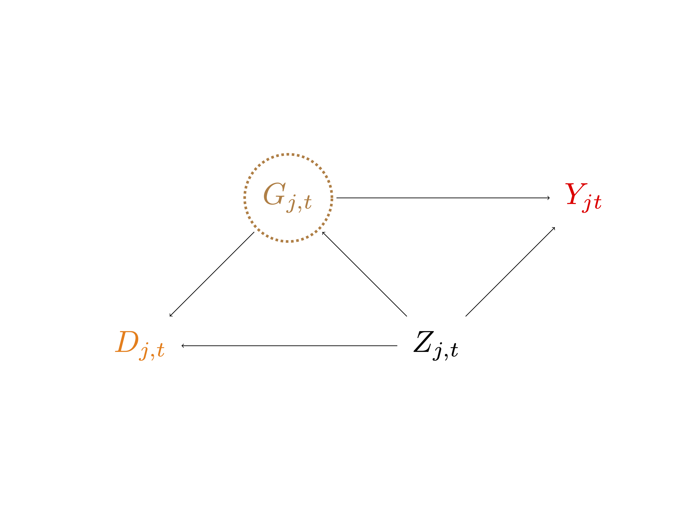
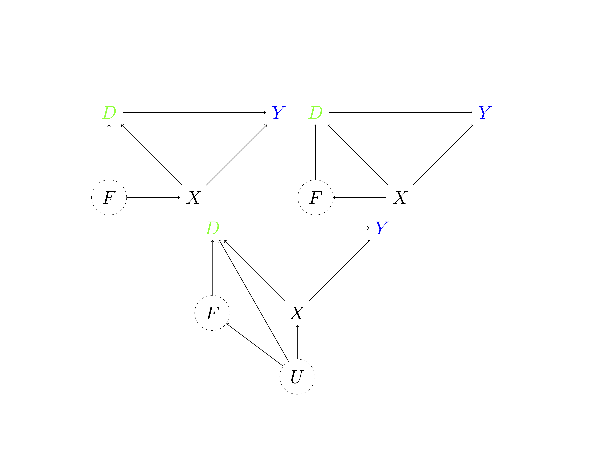
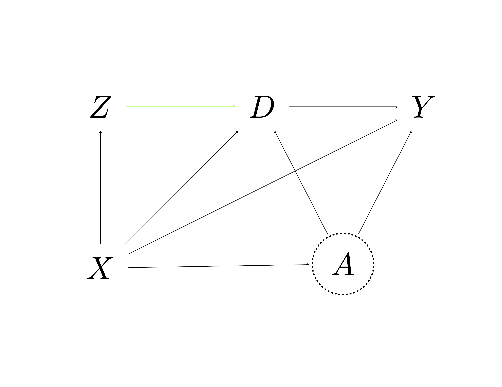

# Statistical Inference on Predictive and Causal Effects in Modern Nonlinear Regression Models

## Introduction

-   Here we discuss double/debiased machine learning (DML) methods for
    performing inference on average predictive or causal effects in the
    important classes of models: partially linear regression models, interactive regression models and interactive IV models.

-   We also present a general DML method for performing inference on a
    low-dimensional target parameter in the presence of high dimensional
    nuisance parameters that are learned using ML methods.

-   Two case studies illustrate the approach in the tutorial. In the
    first, we perform inference on the effect of gun ownership on
    homicide rates. In the second, we perform inference on the effect of
    401(k) eligibility on financial assets.

------------------------------------------------------------------------

-   We recall the predictive effect question: How does the predicted
    value of outcome, $$\mathbb{E}[Y \mid D, X],$$ change if a regressor
    value $D$ increases by a unit, while regressor values $X$ remain
    unchanged?

-   This question may have a causal interpretation within any SEM, where
    conditioning on $X$ is sufficient for identification of the causal
    effect of $D$ on $Y$. When this condition holds, the question
    becomes the causal effect question: How does the predicted value of
    potential outcome, $$\mathbb{E}[Y(d) \mid X],$$ change if we
    intervene and change the treatment value $d$ by a unit, conditional
    on the observed $X$?

------------------------------------------------------------------------

-   In what follows, we set up double/debiased machine learning (DML) methods
    for answering these questions with data. These statistical inference
    methods **do not** distinguish between the two types of questions,
    so the methods are equally applicable to answering both types.

-   The DML method requires a Neyman-orthogonal representation of the
    target parameters to reduce the spillover of regularization biases
    inherent in ML methods onto the estimation of the target parameter.
    The method also makes use of cross-fitting: an efficient form of
    sample splitting that eliminates biases that may arise from
    overfitting.

## DML Inference in the Partially Linear Regression Model (PLM)

-   We first answer the questions posed above within the context of the
    partially linear regression model: $$
    \begin{equation}\label{eq:PLM}
     Y = \alpha D + g(X) + \epsilon,  \quad  \mathbb{E}[\epsilon \mid D, X]= 0,
    \end{equation}
    $$ {#eq-PLM} where $Y$ is the outcome variable, $D$ is the regressor
    of interest, and $X$ is a high-dimensional vector of other
    regressors or features, called "controls."
-   The coefficient $\alpha$ is the target parameter of interest. In the following we discuss the estimation of $\alpha$ and how to construct valid confidence intervals.

------------------------------------------------------------------------

-   The model allows a part of the regression function, $g(X)$, to be
    fully nonlinear, which generalizes the approach we have considered
    before.

-   However, the model is still not fully general, because it imposes additivity in $g(X)$ and $D$. We will consider the fully unrestricted model later, where we analyze the fully
    interactive regression model (IRM) in the context of a binary
    treatment $D$.

-   It is worth pointing out though that the partially linear model is not as restrictive as it appears at a first sight since we can consider explicit interactions within the partially linear framework.

## Simultaneous Inference

-   Given a raw treatment, $\bar D$, we can create the technical treatment $D: = \bar D P(Z)$, where $P(Z)$ is an $L-$dimensional dictionary of transformations of the control variables $Z$.

-   Then we can consider the model
    $$Y = \sum_{l=1}^L \alpha_l D_l+ g(Z)  + \epsilon,$$ where
    $\mathbb{E}[\epsilon \mid Z, D]= 0$. We can re-write this as
    $$Y = \alpha_l D_l + g_l(X_l) + \epsilon, \quad \mathbb{E}[\epsilon \mid D_l, X_l] = 0,$$
    where $g_l(X_l) := \sum_{k \neq l} \alpha_k D_k + g(Z)$ and
    $X_l:= ( ( D_k)_{k \neq l}, Z)$. 
    
-   We therefore obtain exactly a model of the partially linear form in @eq-PLM. We can apply DML methods to learn and perform inference on each element of $(\alpha_l)_{l=1}^L$ or even carry out joint inference (similarly to what we have done in Lecture 4).

## Partialling-Out

-   In what follows, we will employ the partialling-out $X$ operation of
    the form that inputs a random variable $V$ and outputs the
    residualized form: $$
    \tilde V : = V - \mathbb{E}[V \mid X].
    $$ Applying this operation to @eq-PLM we obtain: $$
    \begin{equation}\label{decompose3}
     \tilde Y = \alpha \tilde D+ \epsilon,  \quad \mathbb{E}[\epsilon \tilde D] =0,
    \end{equation}
    $$ where $\tilde Y$ and $\tilde D$ are the residuals left after
    predicting $Y$ and $D$ using $X$. Specifically, we have that $$
    \tilde Y := Y - \ell(X) \ \text{and} \ \tilde D := D - m(X),
    $$ where $\ell(X)$ and $m(X)$ are defined as conditional
    expectations of $Y$ and $D$ given $X$: $$
    \ell(X) :=  \mathbb{E}[Y \mid X] \ \text{and} \  m(X) : = \mathbb{E}[D \mid X].
    $$

------------------------------------------------------------------------

-   Here we recall that the conditional expectations of $Y$ and $D$
    given $X$ are the best predictors of $Y$ and $D$ using $X$.

-   The equation $\mathbb{E}[\epsilon \tilde D]= 0$ above is the Normal
    Equation for the population regression of $\tilde Y$ on $\tilde D$.

## FWL Partialling-Out for Partially Linear Model

::: {#thm-FWL}
Suppose that $Y$, $X$ and $D$ have bounded second moments. Then the
population regression coefficient $\alpha$ can be recovered from the
population linear regression of $\tilde Y$ on $\tilde D$: $$
\alpha :=  \{a:  \mathbb{E}[(\tilde Y - a \tilde D) \tilde D]  = 0 \} :=  \mathbb{E}[\tilde D^2]^{-1} \mathbb{E}[\tilde D \tilde Y],
$$ where $\alpha$ is uniquely defined if $D$ cannot be perfectly
predicted by $X$, i.e. if $\mathbb{E} [\tilde D^2] > 0$.
:::

-   Thus, $\alpha$ can be interpreted as a regression coefficient of
    *residualized* $Y$ on *residualized* $D$, where the residuals are
    defined by respectively subtracting the conditional expectation of
    $Y$ given $X$ and $D$ given $X$ from $Y$ and $D$. This result
    generalizes the FWL from linear models to partially linear models.

-   Our estimation procedure for $\alpha$ in the sample will mimic the
    partialling out procedure in the population. We also rely on
    cross-fitting (outlined below) to make sure our estimated
    residualized quantities are not overfit.

## Double/Orthogonal ML for the Partially Linear Model

1.  Partition data indices into random folds of approximately equal
    size: $\{1,...,n\} = \cup_{k=1}^K I_k$. For each fold $k=1,...,K$,
    compute ML estimators $\hat \ell_{[k]}$ and $\hat m_{[k]}$ of the
    conditional expectation functions $\ell$ and $m$, leaving out the
    $k$-th block of data. Obtain the cross-fitted residuals for each
    $i \in I_k$: $$
    \check Y_i = Y_i  - \hat \ell_{[k]}(X_i),   \quad \check D_i = D_i - \hat m_{[k]}(X_i).
    $$

2.  Apply ordinary least squares of $\check Y_i$ on $\check D_i$, that
    is, obtain the $\hat \alpha$ as the root in $a$ of the normal
    equations: $$
    \mathbb{E}_n[(\check Y_i -  a \check D_i) \check D_i]=0.
    $$

3.  Construct standard errors and confidence intervals as in standard
    least squares theory.

------------------------------------------------------------------------

-   In what follows it will be convenient to use the notation $$
    \| h \|_{L^2} := \sqrt{\mathbb{E}_X[h^2(X)]},
    $$ where $\mathbb{E}_X$ computes the expectation over values of $X$.

-   To do valid inference on the target parameter, is crucial that
    estimators $\hat \ell_{[k]}(X)$ and $\hat m_{[k]}(X)$ provide
    approximations to the best predictors $\ell(X)$ and $m(X)$ that are
    of sufficiently high quality: $$
    n^{1/4}( \| \hat \ell_{[k]} - \ell\|_{L^2} +  \| \hat m_{[k]} - m\|_{L^2}) \approx 0.
    $$

-   This implies that both estimators $\hat \ell$ and $\hat m$
    convergences at least at rate $o(n^{-1/4})$ to the true nuisance
    functions $\ell$ and $m$ measured in $L^2$-norm.

## Adaptive Inference on a Target Parameter in PLM

::: {#thm-DML}
Consider the PLM model in @eq-PLM. Suppose that $\mathbb{E}[\tilde D^2]$
is bounded away from zero and that $$
n^{1/4}( \| \hat \ell_{[k]} - \ell\|_{L^2} +  \| \hat m_{[k]} - m\|_{L^2}) \approx 0.$$
Suppose further regularity conditions listed in @DML.

Then the estimation error in $\check D_i$ and $\check Y_i$ has no first
order effect on $\hat\alpha$: $$
\sqrt{n} (\hat\alpha- \alpha)  \approx  \mathbb{E}_n[\tilde D^2]^{-1} \sqrt{n} \mathbb{E}_n[\tilde D \epsilon]. 
$$
:::

------------------------------------------------------------------------

-   Consequently, $\hat \alpha$ concentrates in a $1/\sqrt{n}$
    neighborhood of $\alpha$ with deviations approximated by the
    Gaussian law: $$
    \sqrt{n} (\hat \alpha - \alpha)  \overset{{\mathrm{D}}}{\rightarrow}  N(0 ,  \mathsf{V}),
    $$ where $$
    \mathsf{V} = (\mathbb{E} \tilde D^2)^{-1}  \mathbb{E} (\tilde D^2 \epsilon^2 )  (\mathbb{E} \tilde D^2)^{-1}.
    $$

-   **Confidence Interval**: The standard error of $\hat \alpha$ is
    $\sqrt{\hat{\mathsf{V}}/n}$, where $\hat{\mathsf{V}}$ is an
    estimator of $V$. The result implies that the confidence interval $$
    \left[\hat \alpha - 2 \sqrt{\hat{\mathsf{V}}/n}, \hat \alpha + 2\sqrt{\hat{\mathsf{V}}/n}\right]
    $$ covers $\alpha$ in approximately $95\%$ of possible realizations
    of the sample. In other words, if our sample is not atypical, the
    interval covers the truth.

## Selecting the Best ML Learners of $\ell$ and $m$.

-   There may be several methods that satisfy the quality requirements
    of @thm-DML, and we may therefore ask what ML methods we should use
    in practice. Our goal would be to select the methods that
    minimize an upper bound on the bias of the DML estimator.

-   The bias of the DML estimator is controlled by the mean square
    approximation errors (MSAE): \begin{equation}\label{eq: errors}
    \frac{1}{K} \sum_{k=1}^K  \| \hat \ell_{[k]} - \ell\|^2_{L^2} \text { and } \frac{1}{K} \sum_{k=1}^K  \| \hat m_{[k]} - m \|^2_{L^2}.
    \end{equation} Therefore, we can select the best ML method for
    estimating $m$ and the best method for estimating $\ell$ to minimize
    the upper bound on the bias. We will be using mean square prediction
    errors as proxies for MSAEs.

------------------------------------------------------------------------

-   Two different ML methods may be the best for predicting $Y$ and
    predicting $D$. By doing MSPE minimization we in fact minimize
    MSAEs, since MSPEs approximate MSAEs plus terms that do not depend
    on $j$.

-   Rather than selecting the single best predictors of $Y$ and $D$, we
    can also use residuals to form linear ensembles of ML methods that
    minimize MSPEs.

## Discussion of DML Construction

-   The partialling-out operation causes the moment equations defining
    $\alpha$ to be Neyman-orthogonal. That is, the moment conditions are
    insensitive to perturbations of the nuisance parameters $\ell$ and
    $m$.\

-   Generally we use the term nuisance parameters to name parameters
    that are not the target parameters. Here the target parameter is
    $\alpha$ and $\ell$ and $m$ are nuisance parameters.

-   We already discussed Neyman-orthogonality in the context of
    high-dimensional linear regression models in Lecture 4. We return to
    and generalize this discussion formally later in this lecture.

-   Naive application of machine learning methods directly to outcome
    equations may lead to highly biased estimators, because the
    resulting strategy is not Neyman-orthogonal.

-   The biases in estimation of $g$ in @eq-PLM, which are unavoidable in
    high-dimensional estimation, create a non-trivial bias in the
    estimate of the main effect. This bias is large enough to cause
    failure of conventional inference.

## Simulation Study I

{#fig-orth}

------------------------------------------------------------------------

-   The left panel in @fig-orth illustrates the bias arising due to the
    use of a non-orthogonal, naive approach for learning $\alpha$.
    Specifically, the figure shows the behavior of a conventional
    (non-orthogonal) ML estimator, $\tilde \alpha$, in the partially
    linear model in a simple simulation experiment where we learn $g$
    using a random forest. The $g$ in this experiment is a very smooth
    function of a small number of variables, so the experiment is
    seemingly favorable to the use of random forests a priori.

-   The histogram shows the simulated distribution of the centered
    estimator, $\tilde \alpha - \alpha$. The estimator is badly biased,
    shifted much to the right relative to the true value $\alpha$.
    Furthermore, the distribution of the estimator (approximated by the
    blue histogram) is substantively different from a normal
    approximation (shown by the red curve) derived under the assumption
    that the bias is negligible.

------------------------------------------------------------------------

-   This biased performance of the naive estimator can also be explained
    analytically. The naive strategy relies on the moment equation: $$
    \mathbb{E}[(Y - \alpha D - g(X) ) D] = 0  
    $$ to identify $\alpha$ and uses a biased estimate of $g$ in place
    of $g$. This moment strategy is sensitive to deviations away from
    the true value. Indeed, let us compute the directional derivative in
    the direction $\Delta$ away from the true value: $$
    \partial_t \mathbb{E} [(Y - \alpha D - g(X) + t \Delta(X) ) D]  \Big |_{t=0} =  \mathbb{E}[\Delta (X) D]\neq 0.
    $$

-   The derivative generally does not vanish, and the biases in
    estimation of $g$ will transmit to the estimation of $\alpha$.

------------------------------------------------------------------------

-   The right panel in @fig-orth illustrates the behavior of the
    (Neyman) orthogonal DML estimator, $\hat \alpha$, in the partially
    linear model in a simple experiment where we learn nuisance
    functions $m$ and $\ell$ using random forests. Note that the
    simulated data are exactly the same as those underlying the left
    panel. The simulated distribution of the centered estimator,
    $\hat \alpha - \alpha$, (given by the blue histogram) illustrates
    that the estimator is approximately unbiased, concentrates around
    $\alpha$, and is approximately normally distributed. The low bias
    arises because DML uses the Neyman-orthogonal moment equations.

-   The DML algorithm uses a form of sample splitting, called
    cross-fitting, to make sure our estimated residualized quantities
    are not overfit. Biases arising from overfitting could result from
    using highly complex fitting methods such as boosting, deep neural
    networks and random forests. If we don't do sample splitting and the
    ML estimates overfit, we may end up with very large biases (see
    @fig-crossf).

-   Again, this [shiny app](https://github.com/DoubleML/BasicsDML)
    illustrate the problem of overfitting and the use of cross-fitting.

## Simulation Study II

{#fig-crossf}


## The Effect of Gun Ownership on Homicide Rates

-   We consider the problem of estimating the effect of gun ownership on
    the homicide rate. For this purpose, we estimate the partially
    linear model: $$
     Y_{j,t} = \alpha D_{j,(t-1)} + g(Z_{j,t}) + \epsilon_{j,t}.
    $$

-   $Y_{j,t}$ is the log homicide rate in county $j$ at time $t$.
    $D_{j, t-1}$ is the log fraction of suicides committed with a
    firearm in county $j$ at time $t-1$, which we use as a proxy for gun
    ownership $G_{j,t}$, which is not observed. $Z_{j,t}$ is a set of
    demographic and economic characteristics of county $j$ at time $t$.

-   Control variables $Z_{j,t}$ are from the U.S. Census Bureau and
    contain demographic and economic characteristics of the counties
    such as the age distribution, the income distribution, crime rates,
    federal spending, home ownership rates, house prices, educational
    attainment, voting patterns, employment statistics, and migration
    rates.

-   The intent here is that parameter $\alpha$ is an approximation of
    the causal effect of gun ownership $G_{j,t}$ on homicide rates
    $Y_{j,t}$, controlling for county-level demographic and economic
    characteristics.

------------------------------------------------------------------------

-   To account for fixed heterogeneity across counties and time trends
    in all variables, we have removed county-specific and time-specific
    effects from all variables prior to estimation. The sample covers
    195 large United States counties between the years 1980 through
    1999, giving us 3900 observations.

-   An other way to flexibly account for fixed heterogeneity across
    counties, common time factors, and deterministic time trends, we
    might also include county-level averages, time period averages,
    initial conditions, and the time index as additional control
    variables. This strategy is related to strategies for addressing
    latent sources of heterogeneity via conditioning as in
    @wooldridge:TWFE.

-   Finally, for simplicity in this illustration, we assume that all
    sources of dependence are accounted for by observed variables such
    that we may take $\epsilon_{j,t}$ as independent across counties,
    $j$, and over time, $t$.

------------------------------------------------------------------------

<!--  -->


------------------------------------------------------------------------

-   Here we approximate the average causal effect $G_{j,t} \to Y_{jt}$
    only if $G_{j,t} \approx D_{j,t-1}$. Under the assumption that
    $D_{j,t-1}$ is equal to $G_{j,t}$ plus an additive, independent
    measurement error, the target parameter $\alpha$ will be attenuated
    relative to the true causal effect.

-   We might also include nodes for latent county specific and time
    period specific shocks in our DAG. Often such shocks are accounted
    for with so-called "fixed effects" which typically leverage strong
    functional form assumptions. If we include county-level averages,
    time period averages, initial conditions, and the time index as
    additional control variables, we instead leverage the different,
    though still strong assumption that flexibly conditioning on
    observables, including time- and county- specific variables, is a
    valid identification strategy.

------------------------------------------------------------------------


------------------------------------------------------------------------

-   As a summary statistic we first look at a simple regression of
    $Y_{j,t}$ on $D_{j,t-1}$ without controls. The point estimate is
    $0.282$ with the confidence interval ranging from $0.17$ to $0.39$.
    These results suggest that increases in gun ownership rates are
    associated with (predicted) gun homicide rates -- if gun ownership
    increases by $1\%$ relative to the estimated trend then the
    predicted gun homicide rate goes up by $0.28\%$, without controlling
    for time-varying county characteristics. Since our goal is to
    estimate the effect of gun ownership after controlling for a rich
    set of county characteristics, we next include the controls and
    estimate the model by an array of the modern regression methods that
    we've learned.
    
- The Notebook of the empirial analysis can be found [here](https://drive.google.com/file/d/1xfEUTnJzCNczZFMc5ElOqldbuxyATri_/view?usp=sharing).

------------------------------------------------------------------------

```{=html}
<table>
  <tr>
    <th></th>
    <th>Estimate</th>
    <th>Standard Error</th>
  </tr>
  <tr>
    <td>Baseline OLS</td>
    <td>0.282</td>
    <td>0.065</td>
  </tr>
  <tr>
    <td>Least Squares with controls</td>
    <td>0.191</td>
    <td>0.052</td>
  </tr>
  <tr>
    <td>Lasso</td>
    <td>0.223</td>
    <td>0.057</td>
  </tr>
  <tr>
    <td>Post-Lasso</td>
    <td>0.227</td>
    <td>0.056</td>
  </tr>
  <tr>
    <td>CV Lasso</td>
    <td>0.200</td>
    <td>0.058</td>
  </tr>
  <tr>
    <td>CV Elnet</td>
    <td>0.206</td>
    <td>0.057</td>
  </tr>
  <tr>
    <td>CV Ridge</td>
    <td>0.201</td>
    <td>0.058</td>
  </tr>
  <tr>
    <td>Random Forest</td>
    <td>0.192</td>
    <td>0.058</td>
  </tr>
  <tr>
    <td>Best</td>
    <td>0.219</td>
    <td>0.057</td>
  </tr>
</table>
```

---

- The table shows the estimated effects of the lagged gun ownership rate on the gun homicide rate as well as the standard error. We first focus on the Lasso method: The estimated effect is about $.22$. This means that a $1\%$ increase in gun ownership rate (as measured by the proxy) leads to a predicted  near quarter percent increase in gun homicide rates.  The  $95\%$ confidence interval  for the effect ranges from $0.12$ to $0.32$. These estimates are slightly higher than the ones obtained by the Least Squares Method. Random Forest also gives similar estimates to OLS, though with somewhat wider confidence bands.

- The last row of the table provides the "best" estimates. To obtain "best"  estimates we evaluate the performance of predictors $\hat \ell(X)$ and $\hat m(X)$ estimated by different methods on auxiliary samples using the main sample. Then we pick the methods giving the lowest MSE. In our case ridge regression and lasso give the best performances in predicting $Y_{j,t}$ and $D_{j,t-1}$, respectively.  We then use the best methods as predictors in the estimation procedure described above. The resulting estimate of the gun ownership effect and standard error are similar to that of Lasso.

## DML Inference in the Interactive Regression Model (IRM)

- We consider estimation of average treatment effects when treatment effects are fully heterogeneous and the treatment variable is binary. We consider vectors $W=(Y,D,X)$ and the pair of regression equations:
$$
 \begin{eqnarray}\label{eq: HetPL1}
 & Y  = g_0(D,X) + \epsilon,  &  \quad \mathbb{E}[\epsilon \mid X, D]= 0, \\
  & D  = m_0(X) + \tilde D, \label{eq: HetPL2}  & \quad  \mathbb{E}[\tilde D\mid X] = 0,
\end{eqnarray} 
$$ {#eq-HetPL1}
where the second regression equation is presented for convenience.  

- Here $Y$ is an outcome of interest, $D \in \{0,1\}$ is a binary policy or
treatment variable, and $X$ are controls/confounding factors. Since $D$ is not additively separable in the first equation, this model is more general than the partially linear model for the case of binary $D$. 

---

- A common target parameter of interest in this model is the average predictive effect (APE),
$$
\theta_0 = \mathbb{E}[ g_0(1,X) - g_0(0,X)].
$$
This quantity is the average predictive effect of switching $D=0$ to $D=1$. Under
conditional exogeneity discussed in Lecture 5 and Lecture 6, the APE coincides with the average treatment effect (ATE) of
the intervention that moves $D=0$ to $D=1$.

- The confounding factors $X$ affect the policy variable via the propensity score $m_0(X)$ and the outcome variable via the function
$g_0(D,X)$. Both of these functions are unknown (except for the case of RCTs, where $m_0(X)$ is known) and potentially complicated,
and we can employ ML methods to learn them. 

---

- Our construction of the efficient estimator for ATE will be based upon the relation
$$
\begin{equation}\label{eq:DML-IRM}
\theta_0 = \mathbb{E}[\varphi_0(W)],
\end{equation} 
$$ {#eq-DMLIRM}
where
$$
\varphi_0(W) = g_0 (1,X) - g_0(0,X) + (Y- g_0(D,X)) H_0
$$
and
$$
 H_0 = \frac{1(D=1)}{m_0(X)} -  \frac{1(D=0)}{1-m_0(X) }
$$
is the Horvitz-Thompson transformation. 

---

- We realize that this representation encompasses two equally valid representations of the target parameter: the regression adjusted representation,
$$
 \theta_0 = \mathbb{E}[g_0 (1,X) - g_0(0,X)],$$
 and the propensity score reweighting representation,
  $$
 \theta_0  =  \mathbb{E}[YH_0].
 $$
Unfortunately *neither* of these representations is Neyman orthogonal, making them unsuitable for plugging-in machine learning estimators. In sharp contrast, 
the representation  in @eq-DMLIRM  is Neyman orthogonal, which implies that we can readily deploy ML
methods for estimation using the empirical analog of this expression coupled with cross-fitting.

---

- The construction provided in @eq-DMLIRM is equally applicable in cases where the propensity score $\Pr(D=1|X)$ is known, as in stratified randomized experiments, and in cases where the propensity score is unknown. When the propensity score is known, the role of regression adjustment in @eq-DMLIRM is to reduce estimation noise.

- We will employ the Neyman orthogonal parameterization and cross-fitting to construct a high-quality
estimator and perform statistical inference on the target parameter.

## DML for APEs/ATEs in IRM

1. Partition sample indices into random folds of approximately equal size: $\{1,...,n\} = \cup_{k=1}^K I_k$.
For each $k=1,...,K$, compute estimators $\hat g_{[k]}$ and $\hat m_{[k]}$ of  the conditional expectation functions $g_0$ and $m_0$,
leaving out the $k$-th block of data, such that $\epsilon\leq \hat m_{[k]} \leq 1-\epsilon$, and for each $i\in I_k$ compute
$$
\hat \varphi (W_i) = \hat g_{[k]} (1,X_i) - \hat g_{[k]}(0,X_i) + (Y_i- \hat g_{[k]}(D_i,X_i)) \hat H_i
$$
with $\hat H_i = \frac{1(D_i=1)}{\hat m_{[k]}(X_i)} -  \frac{1(D_i=0)}{1-\hat m_{[k]}(X_i) }$.

2.  Compute the estimator $\hat\theta = \mathbb{E}_n[\hat \varphi (W_i)]$.

3. Construct standard errors via $$
\sqrt{\hat{\mathsf{V}}/n}, \quad \hat{\mathsf{V}}= \mathbb{E}_n[(\hat \varphi(W_i) - \hat \theta)^2]$$ and use standard normal critical values for inference.

## Trimming

- An important practical issue is trimming $|\hat H_i|$ from taking explosively large values. Large values can occur when estimated propensity scores are near 0 or 1, which may indicate failure of
the overlap condition (see Lecture 5) and restated in @thm-DMLATE below. In the algorithm above, $\hat H_i$
can take on the largest absolute value of $\bar H = 1/\epsilon$. Therefore, setting $\epsilon =.01$ corresponds
to $\bar H =100$.  There does not seem to be a good theoretical or practical resolution on how to do trimming.

## Adaptive Inference on ATE with DML

::: {#thm-DMLATE}
Suppose conditions specified in @DML hold. In particular, suppose that the overlap condition holds, namely for some $\epsilon>0$ with probability 1 $\epsilon<  m_0(X) < 1-\epsilon$. If the estimators $\hat g_{[k]}(D,X)$ and $\hat m_{[k]}(X)$
<!-- estimators $\hat g_{[k]}(D,X)$ and $\hat m_{[k]}(X)$ are such that -->
<!-- $\epsilon \leq \hat m_{[k]}(X)\leq  1-\epsilon$  and -->
provide sufficiently high quality approximations to the best predictors $g_0(D, X)$ and $m_0(X)$ such that
$$
\| \hat g_{[k]}  - g_0  \|_{L^2} + \| \hat m_{[k]}  - m_0\|_{L^2} 
+ \sqrt{n} \| \hat g_{[k]} - g_0\|_{L^2}  \| \hat m_{[k]} - m_0 \|_{L^2} \approx 0,
$$
then the estimation error in these nuisance parameter has no first order effect on $\hat \theta$:
$$
\sqrt{n} (\hat \theta - \theta_0) \approx \sqrt{n} \mathbb{E}_n [\varphi_0(W) - \theta_0].
$$
Consequently, the estimator concentrates in $1/\sqrt{n}$ neighborhood of $\theta_0$, with deviations
controlled by the Gaussian law:  $$
\sqrt{n} (\hat \theta - \theta_0)  \overset{{\mathrm{D}}}{\rightarrow} N(0 ,  \mathsf{V})
$$
where $\mathsf{V} =  \mathbb{E}[(\varphi_0(W) - \theta_0)^2]$.
:::

---

- The condition on the quality of estimators of $g_0$ and $m_0$ provides a possibility of "trading off" the quality of each estimator while retaining the adaptive inference property. The better we estimate the propensity score $g_0$, the worse our estimate of the regression
function $m_0$ can be; and vice versa.

- We may also be interested in average effects for interesting subpopulations such as group ATEs (GATEs):
$$
\theta_0 = \mathbb{E}[ g_0(1,X) - g_0(0,X)|G=1],
$$   
where $G$ is a group indicator defined in terms of $X$'s.
For example, we might be interested in the impact of a vaccine on teenagers, in which case we could set $G = 1(13 \leq Age \leq 19)$, or on older individuals, in which case we might set $G = 1(65 \leq Age)$. DML estimation and inference for GATEs can be carried out similarly to estimation and inference for the ATE by exploiting the relation
$$
\theta_0 =\mathbb{E}[\varphi_0(X) |G =1]=  \mathbb{E} [\varphi_0(X) G]/\Pr(G=1).
$$


## The effect of 401(k) Eligibility on Net Financial Assets

- Here we re-analyze the impact of 401(k) eligibility on financial assets (@pvw:94 and @pvw:95). The data covers a short period a few years after the introduction of 401(k)'s when they were rapidly increasing in popularity.
 
- The key problem in determining the effect of 401(k) eligibility is that working for a firm that offers access to a 401(k) plan is not randomly assigned. To overcome the lack of random assignment, we follow the strategy developed in @pvw:94 and @pvw:95. In these papers, the authors use data from the 1991 Survey of Income and Program Participation and argue that eligibility for enrolling in a 401(k) plan in this data can be taken as exogenous after conditioning on a few observables of which the most important for their argument is income. 
 
---

- The basic idea of their argument is that, at least around the time 401(k)'s initially became available, people were unlikely to be basing their employment decisions on whether an employer offered a 401(k) but would instead focus on income and other aspects of the job. Following this argument, whether one is eligible for a 401(k) may then be taken as exogenous after appropriately conditioning on income and other control variables related to job choice.

- A key component of the argument underlying the exogeneity of 401(k) eligibility is that eligibility may only be taken as exogenous after conditioning on income and other variables related to job choice that may correlate with whether a firm offers a 401(k). @pvw:94 and @pvw:95 and many subsequent papers adopt this argument but control for parsimonious, pre-specified functions of what they deem to be relevant characteristics. One might wonder whether such specifications are able to adequately control for income and other related confounders.  At the same time, the power to learn about treatment effects decreases as one allows more flexible models.  The principled use of flexible ML tools offers one resolution to this tension.  

---

- In what follows, we use net financial assets (the sum of IRA balances, 401(k) balances, checking accounts, U.S. saving bonds, other interest-earning accounts in banks and other financial institutions, other interest-earning assets (such as bonds held personally), stocks, and mutual funds less non-mortgage debt) as the outcome variable, $Y$, in the analysis. The treatment variable, $D$, is an indicator for being eligible to enroll in a 401(k) plan.  The vector of raw covariates, $X$, consists of age, income, family size, years of education, a married indicator, a two-earner status indicator, a defined benefit pension status indicator, an IRA participation indicator, and a home ownership indicator.

---

{#fig-401kDAGs}

---

- It is useful to think about a causal diagram that represents our thinking about identification in this example. In @fig-401kDAGs, we provide three example DAGs for $Y$, the outcome; $D$, the 401(K) eligibility offer which depends on firm characteristics, $F$,
which are not observed; and $X$, the worker characteristics. In one structure, $F$ determines the workers
characteristics (via the hiring decision), so we have $F \to X$. In another structure, workers determine the
characteristics of the company they choose to work at, $X \to F$. Finally, in the last structure $F$, $X$, and 
$D$ are jointly determined by a set of latent factors $U$. In any of these cases, $X$ a valid adjustment set because it is
the only parent of $Y$ (other than $D$).

- It is also useful to consider structures that would break down the identification strategy. We illustrate two such structures in @fig-401kBadDAG1 and @fig-401kBadDAG2. In these figures, we introduce a node for the employer match amount $M$, which could mediate the effect of 401(k) eligibility and have an important effect on financial wealth. Employers often offer a benefit where they will match a proportion of an employee's contribution to their 401k, up to a limit. The limit is referred to as the employer match amount, and averages between 4 and 5\% of employee's salaries. 

---

{#fig-401kBadDAG1}

---

{#fig-401kBadDAG2}

---

- In @fig-401kBadDAG1, we suppose that $M$ is determined by unobserved firm characteristics, $F$, and worker characteristics, $X$. In this case, adjustment for $X$ is not sufficient as there is a path from latent firm characteristics, which are related to the treatment and to the outcome that is not closed by $X$. However, if $M$ is determined solely by $D$ and $X$ so the red arrow is erased, adjustment for $X$ is sufficient. Therefore, interpreting our the target parameter of our estimation strategy as a causal effect is only valid if the match amount
is independent of $F$ given $D$ and $X$. Otherwise, the default interpretation is that we are estimating predictive effects of 401(k) eligibility.

- In the second example, @fig-401kBadDAG2, we maintain the assumption that $M$ is independent of $F$ given $D$ and $X$ by eliminating the arrow between nodes $F$ and $M$. However, we now allow for the possibility that latent variables $U$ have a direct effect on $Y$; that is, we have an unobserved confounder or omitted variable. In this example, such a counfounder may be unobserved risk preferences that relate to an individual's preference over jobs, an individual's characteristics, but also have direct effects on savings decisions not channeled purely through observed individual or job characteristics. 

---

- In general, the possibility of latent confounders always poses a challenge to obtaining estimates of causal effects in non-experimental data. 

- The presence or absence of latent confounders cannot be determined solely from the data in general, and thus their presence must be argued against based on scientific and institutional knowledge in different contexts. As in the previous example, we must interpret our estimates as predictive effects of 401(k) eligibility if we believe the connection from $U$ to $Y$ exists.

- A detailed discussion of identification and potential DAGs can be found in this [notebook](https://drive.google.com/file/d/10FNLvfr0rr58EKUTk8D8OisderIAl4ix/view?usp=sharing).

## Empirical Results

```{=html}
<table>
  <caption>Estimated Effect of 401(k) Eligibility on Net Financial Assets</caption>
  <thead>
    <tr>
      <th></th>
      <th>Lasso</th>
      <th>Random Forest</th>
      <th>Regression Tree</th>
      <th>Boosting</th>
    </tr>
  </thead>
  <tbody>
    <tr>
      <td colspan="7"><em>A. Interactive Regression Model</em></td>
    </tr>
    <tr>
      <td>ATE</td>
      <td>8850</td>
      <td>8202</td>
      <td>8415</td>
      <td>8048</td>
    </tr>
    <tr>
      <td colspan="7"><em>B. Partially Linear Regression Model</em></td>
    </tr>
    <tr>
      <td>ATE</td>
      <td>9580</td>
      <td>9127</td>
      <td>8210</td>
      <td>8700</td>
    </tr>
    </tr>
  </tbody>
</table>
<p><strong>Note:</strong> Estimated ATE from a partially linear model (Panel B) and interactive regression model (Panel A) based on orthogonal estimating equations. Column labels denote the method used to estimate nuisance functions.</p>
```

---

- The notebook of empirical analysis can be found [here](https://colab.research.google.com/drive/1igC4zlBokApk39IUBiGKpbCYmDlqE3Yl?usp=sharing).

- It is first worth noting that when no controls are used, the estimated ATE of 401(k) eligibility on net financial assets is **\$19,559**.  Of course, this number is not a valid estimate of the causal effect of 401(k) eligibility on financial assets if there are neglected confounding variables as suggested by @pvw:94 and @pvw:95. 

- When we turn to the estimates that flexibly account for confounding, we see that they are substantially attenuated relative to this baseline that does not account for confounding, suggesting much smaller causal effects of 401(k) eligibility on financial asset holdings.  

- The results obtained from the different machine learning methods are broadly consistent with each other. This similarity is consistent with the theory that suggests that results obtained through the use of orthogonal estimating equations and any method that provides sufficiently high-quality estimates of the necessary nuisance functions should be similar. 

---

- The results are also broadly consistent with those reported in the original work of \cite{pvw:94} and \cite{pvw:95} which used a simple, intuitively-motivated functional form, suggesting that this intuitive choice was sufficiently flexible to capture much of the confounding variation in this example.

- So far we considered the effect of eligibility on net financial assets but one might also be interested in the effect of 401(k) participation on net financial assets which leads to the following model..

## The LATE Model

- An important nonlinear IV model is the local average treatment effect model (LATE), proposed by Imbens and Angrist (@imbens:angrist:94).

{#fig-late}

---

- Consider the SEM, where

$$
\begin{eqnarray*}
Y &:=&  f_Y (D, X, A, \epsilon_Y) \\
D &:= & f_D(Z, X, A, \epsilon_D) \in \{0,1\},  \\ 
Z  &:= & f_Z(X,\epsilon_Z) \in \{0,1\},  \\
X &:=&  \epsilon_X, \quad A = \epsilon_A,
\end{eqnarray*}
$$ where $\epsilon$'s are all independent,
and 
$$
z \mapsto f_D(z , A, X, \epsilon_D) \text{ is weakly increasing (weakly monotone)}.
$$

---

- Suppose the instrument $Z$ is an offer to participate in a training program and that $D$ is the actual endogenous participation in the training program. Participation in the program may depend on unobservables $A$, such as ability or perseverence,
that also affect the eventual outcome $Y$.  We can also have
background exogenous covariates $X$ in the model.

- The model allows us to identify the local average treatment effect (LATE), defined as
$$
\theta = \mathbb{E}[Y(1) - Y(0) \mid D(1) > D(0)], 
$$
where $\{D(1)> D(0)\}$ is the compliance event, where switching instrument value from $Z=0$ 
to $Z=1$ induces participation. Therefore LATE measures the average treatment effect conditional
on compliance. 


---

In the LATE model,  we have that $\theta$
is identified by the ratio of two statistical parameters,
$$
\theta  = \theta_1/\theta_2,$$ where
$$
\theta_1 :=  \mathbb{E}[\mathbb{E}[Y \mid X, Z=1] - \mathbb{E} [Y \mid X, Z=0] ],$$
and
$$
\theta_2 := \mathbb{E}[\mathbb{E}[D \mid X, Z=1] - \mathbb{E} [D \mid X, Z=0]],
$$
provided that the instrument $Z$ is relevant, $\theta_2 >0$, and $Z$ has full conditional support -- namely $0< P(Z =1 |X)<1$. Moreover, $\theta_2$ identifies the probability of compliance: 
$$
\theta_2 = \Pr[D(1) > D(0)].
$$

## Inference in the Interactive IV Regression Model (IIVM)

- In this section, we consider estimation of local average treatment effects (LATE) with a binary treatment variable, $D\in\{0,1\}$, and a binary instrument, $Z\in\{0,1\}$.  As before, $Y$ denotes the outcome variable, and $X$ is the vector of covariates. 

- Consider the following statistical parameter:

$$
\theta_0 = \frac{\mathbb{E}[\mathbb{E} (Y \mid Z=1, X) - \mathbb{E} (Y \mid Z=0, X) ]}{\mathbb{E}[\mathbb{E} (D \mid Z=1, X)- \mathbb{E} (D \mid  Z=0, X)]}.
$$

- This parameter is the ratio of the average predictive effects of $Z$ on $Y$ and of $D$ on $Y$. Under the assumptions laid out on the previous slides this parameter is a causal parameter, i.e. the average treatment effect for compliers (LATE).

---

- To set up estimation, define the regression functions:
$$\begin{align*}
&  \mu_0(Z,X) = \mathbb{E}[ Y \mid Z, X] \\
& m_0(Z,X) = \mathbb{E} [D \mid Z, X] \\
& p_0(X) =  \mathbb{E} [Z \mid  X].
\end{align*}$$

---

- Define the nuisance parameter $\eta = (\mu, m, p)$ to denote square-integrable functions $\mu$, $m$, and $p$, with $\mu$ mapping the support of $(Z,X)$ to $\mathbb R$ and $m$ and $p$ respectively mapping the support of $(Z,X)$ and $X$ to $(\varepsilon, 1 - \varepsilon)$ for some $\varepsilon\in (0,1/2)$. 

- The true value of the nuisance parameter is $\eta_0 = (\mu_0, m_0, p_0)$, the regression functions defined above.

- The DML estimator of $\theta_0$ employs the orthogonal score
$$
\begin{align*}
\psi(W; \theta, \eta) 
& := \mu(1,X) - \mu(0,X) + H(p) (Y - \mu(Z,X))  \\
& - \Big(m(1,X) - m(0,X) + H(p)  (D - m(Z,X) \Big) \theta,
\end{align*}
$$
for $W = (Y,D,X,Z)$ and 
$$
H (p) :=   \frac{Z}{p(X)} - \frac{(1 - Z)}{1 - p(X)} .
$$

---

- It is easy to verify (for homework) that this score satisfies the moment condition $$\mathbb{E}[\psi(W; \theta_0,\eta_0)] = 0$$ and also the Neyman orthogonality condition $$\partial_{\eta}\mathbb{E}[\psi(W; \theta_0,\eta_0)] = 0$$ 
at the true value $\eta_0 = (\mu_0, m_0, p_0)$ of the nuisance parameter.  


- Therefore we can apply the generic double ML algorithm to this problem, including the selection of the best ML
methods to estimate the nuisance parameters.

---

Suppose conditions specified in @DML hold. In particular, suppose that the overlap condition holds; namely, for some $\epsilon>0$ with probability 1, $\epsilon<  p_0(X) < 1-\epsilon$. Further, suppose $\epsilon < \hat p_{[k]}(X)< 1-\epsilon$ and that estimators $\hat p_{[k]}$, $\hat m_{[k]}$, $\hat \mu_{[k]}$ provide high quality approximation to $p_0$, $m_0$, and $mu_0$ in the sense that 
$$
n^{1/2} \|\hat  p_0 - p_0 \|_{L^2} \times \Big(\|\hat  \mu_0 - \mu_0 \|_{L^2} + \| \hat m_0 - m_0\|_{L^2}\Big) \approx 0.
$$
Then estimation of the nuisance parameters does not affect the behavior of the estimator to the first order;
namely,
$$
\sqrt{n}(\hat \theta - \theta_0) \approx \sqrt{n} \mathbb{E}_n[\varphi_0(W)],
$$
where 
$$
\varphi_0(W) = - J_0^{-1} \psi(W; \theta_0, \eta_0), \quad J_0 :=  \mathbb{E}[m_0(1,X) - m_0(0,X)].
 $$

---

- Consequently, $\hat \theta$  concentrates in a $1/\sqrt{n}$-neighborhood of $\theta_0$ and the sampling error $\sqrt{n}(\hat \theta - \theta_0)$ is approximately normal
$$
\sqrt{n}(\hat \theta - \theta_0) \overset{{\mathrm{D}}}{\rightarrow}  N(0, \mathsf{V}), \quad \mathsf{V}:=   \mathbb{E}[\varphi_0(W) \varphi_0(W)'].
$$

- Variance estimation and confidence intervals are constructed as in the generic DML algorithm introduced later.

## The effect of 401(k) Participation on Net Financial Assets - continued

- Here we continue to re-analyze the effects of 401(k)'s on household financial asset.  

- In this section, we report the LATE in this example where we take the endogenous treatment variable to be *participating* in a 401(k) plan using 401(k) *eligibility* as instrument.  Even after controlling for features related to job choice, it seems likely that the actual choice of whether to participate in an offered plan would be endogenous. Of course, we can use eligibility for a 401(k) plan as an instrument for participation in a 401(k) plan under the conditions that were used to justify the exogeneity of eligibility for a 401(k) plan.

---

- We report DML results of estimating the LATE of 401(k) participation using 401(k) eligibility as an instrument in the next table.  We employ the procedure outlined using the same ML estimators to estimate the quantities used to form the orthogonal estimating equation as we employed to estimate the ATE of 401(k) eligibility. 

- Looking at the results, we see that the estimated causal effect of 401(k) participation on net financial assets is uniformly positive and statistically significant across all of the considered methods.  

- As when looking at the ATE of 401(k) eligibility, it is reassuring that the results obtained from the different flexible methods are broadly consistent with each other.

##  DML Estimates of LATE on 401(k) Participation on Net Financial Assets

```{=html}
<table>
  <thead>
    <tr>
      <th></th>
      <th>Lasso</th>
      <th>Random Forest</th>
      <th>Regression Tree</th>
      <th>Boosting</th>
    </tr>
  </thead>
  <tbody>
    <tr>
      <td>Estimate</td>
      <td>12802</td>
      <td>11792</td>
      <td>12214</td>
      <td>11861 </td>
  </tr>
  <tbody>
    <tr>
</table>
    <tr>
```

- The results above based on flexible ML methods are broadly consistent with those obtained by applying the same specification for controls as used in @pvw:94 and @pvw:95 and using a linear IV model which returns an estimated effect of participation of **\$13,102** (with slightly higher standard errors). The attenuation may suggest that the simple intuitive control specification used in the original baseline specification is not sufficiently flexible.

## Generic Debiased (or Double) Machine Learning

- A general construction upon which DML estimation and inference can be built relies on a method-of-moments estimator for some low-dimensional target parameter $\theta_0$ based upon the empirical analog of the moment condition
$$
\begin{align}\label{eq: moment}
\mathbb{E}[\psi(W; \theta_0, \eta_0)] = 0,
\end{align}
$$ {#eq-moment}
where we call $\psi$ the score function, $W$ denotes a data vector, $\theta_0$ denotes the true value of a low-dimensional parameter of interest, and $\eta$ denotes nuisance parameters with true value $\eta_0$.  

## The first key input

- The first key input of the generic DML procedure is using a score function $\psi(W; \theta, \eta)$ such that
$$
\mathsf{M}(\theta, \eta) =  \mathbb{E}[\psi(W; \theta, \eta)]
$$
identifies $\theta_0$ when $\eta = \eta_0$, that is,
$$\mathsf{M}(\theta, \eta_0)=0 \text{ if and only if } \theta = \theta_0$$ and the Neyman orthogonality condition
is satisfied:
$$
\begin{align}\label{eq: orthogonality}
\partial_\eta \mathsf{M}(\theta_0, \eta)  \Big |_{\eta = \eta_0} =  0.
\end{align}
$$ {#eq-orthogonality}

- Here, @eq-orthogonality ensures that the moment condition in @eq-moment used to identify and estimate $\theta_0$ is insensitive to small perturbations of the nuisance function $\eta$ around $\eta_0$.  

--- 

- The orthogonality condition is named after Neyman (@NeymanCalpha), because he was the first to propose it in the context of parametric models
with nuisance parameters that are estimated at slower than $1/\sqrt{n}$ rates.

- Using a Neyman-orthogonal score eliminates the first
order biases arising from the replacement of $\eta_0$ with a ML estimator $\hat \eta_0$. Eliminating this bias is important because estimators $\hat \eta_0$ must be heavily regularized in high dimensional settings, so these estimators will be biased in general. The Neyman orthogonality property is responsible for the adaptivity of these estimators -- namely, their approximate distribution will not depend on the fact that the estimate $\hat \eta_0$ contains error as long as the error is sufficiently mild.

## The second key input

- The second key input is the use of high-quality machine learning estimators of the nuisance parameters. 
A sufficient condition in the examples given includes the requirement $$ n^{1/4} \| \hat \eta - \eta_0\|_{L^2} \approx 0.$$

- Different structured assumptions on $\eta_0$ allow us to use different machine-learning tools for estimating $\eta_0$. For instance approximate sparsity for $\eta_0$ in the linear case with respect to some dictionary calls for the use of lasso, post-lasso, or other sparsity-based techniques.

## The third key input

- The third key input is to use a form of sample splitting at the stage of producing the estimator
of the target parameter $\theta_0$, which allows us to avoid *biases* arising from overfitting.  

- Overfitting can easily occur when using highly complex fitting methods such as boosting, random forests, deep nets, ensembles, and other hybrid machine learning methods. We may heuristically think of overfitting as capturing noise that is particular to the observations used to fit a model in addition to signal. Using overfit estimates of nuisance parameters obtained using the same data as used to estimate the target parameter then heuristically leads to estimation error in these parameters being correlated to outcomes which introduces a type of bias.

## The DML Inference Method

We assume that we have a sample $(W_i)_{i=1}^n$, modeled as i.i.d. copies of data vector $W$, whose
law is determined by the probability measure $P$.   Recall that $\mathbb{E}_n$ denotes the empirical expectation:
$$\mathbb{E}_{n}[ g(W_i)] := \frac{1}{n} \sum_{i=1}^n g(W_i).$$ Let $\mathbb{V}_{n}$ denote the empirical variance:
$$
\mathbb{V}_{n}[ g(W_i)] :=   \mathbb{E}_{n}[g(W_i)g(W_i)'] -  \mathbb{E}_{n}[ g(W_i)]\mathbb{E}_{n}[ g(W_i)]'.
$$

## Generic DML Algortihm

Provide the data frame  $(W_i)_{i=1}^n$,  the Neyman-orthogonal score/moment function $\psi(W, \theta, \eta)$ that identifies the statistical parameter of interest, and the name and model for ML estimation method(s) for $\eta$.

1. **Train ML Predictors on Folds:** Take a K-fold random partition $(I_k)_{k=1}^K$ of observation indices $\{1,..., n\}$ such that the size of each fold
is about the same. For each $k \in \{1,\ldots,K\}$, construct a high-quality machine learning estimator $\hat  \eta_{[k]}$
that depends only on a subset of data $(X_i)_{i \not \in I_k}$ that excludes the $k$-th fold.


2. **Estimate Moments:** Letting $k(i) = \{ k : i \in I_k\}$, construct the moment equation
estimate
$$
\hat{\mathsf{M}}(\theta, \hat \eta) =  \mathbb{E}_{n}[ \psi(W_i;  \theta, \hat \eta_{[k(i)]} ) ] 
$$

3. **Compute the Estimator:** Set the 
 estimator $\hat \theta$
as the solution to the equation
\begin{equation}\label{eq:analog:smooth}
 \hat{\mathsf{M}}(\hat \theta, \hat \eta)   = 0.
\end{equation}

---

4.  **Estimate Its Variance:** Estimate the asymptotic variance of $\hat \theta$ by
$$
\hat{\mathsf{V}} =  \mathbb{V}_n[\hat \varphi(W_i)],
$$
where 
$$
 \hat \varphi(W_i) =  -\hat J_0^{-1}  \psi(W_i; \hat \theta, \hat \eta_{[k(i)]}) 
$$
and
$$
 \hat J_0 := \partial_\theta \mathbb{E}_n [\psi (W_i; \hat \theta, \eta_{[k(i)]})].
 $$

5. **Confidence Intervals:** Form an approximate $(1-\alpha)\%$ confidence interval for 
any functional $\ell'\theta_0$, where $\ell$ is a vector of constants, as 
$$\Big[\ell'\hat \theta \pm c  \sqrt{\ell'\hat{\mathsf{V}} \ell/ n}\Big],$$ where $c$ is the $(1-\alpha/2)$ quantile of $N(0,1)$.


## General Algorithm with Cross-Fitting



## Further Material and Notebooks

- An online tutorial on DoubleML for double/debiased machine learning in R and Python can be found [here](https://www.youtube.com/watch?v=ErecsyKEq74).

- Notebook with exercises [DML Gun Ownership Exercises](https://drive.google.com/file/d/1zQi_EQH75Gsfzl3SCfzKXF7lEWorcEVT/view?usp=sharing).

- Notebook on [Gun Ownership](https://drive.google.com/file/d/1xfEUTnJzCNczZFMc5ElOqldbuxyATri_/view?usp=sharing).

- Notebook on [4O1(k) eligibility/participation](https://colab.research.google.com/drive/1igC4zlBokApk39IUBiGKpbCYmDlqE3Yl?usp=sharing).

- Notebook on [identification](https://drive.google.com/file/d/10FNLvfr0rr58EKUTk8D8OisderIAl4ix/view?usp=sharing) in 4O1(k) example.

- The cross-fitting animation can be found [here](https://www.youtube.com/watch?v=BMAr27rp4uA?autoplay=1).

## Bibliography
