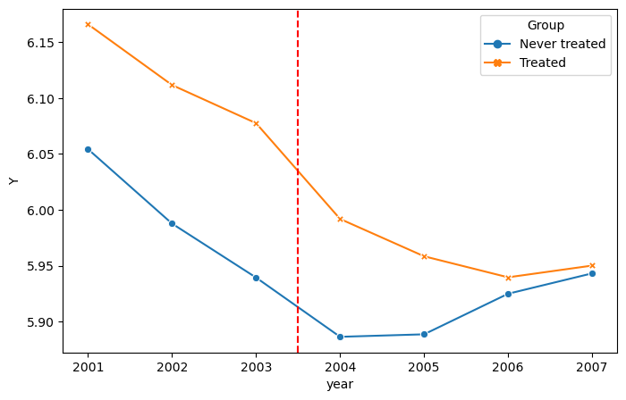
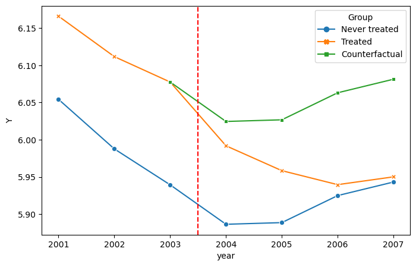
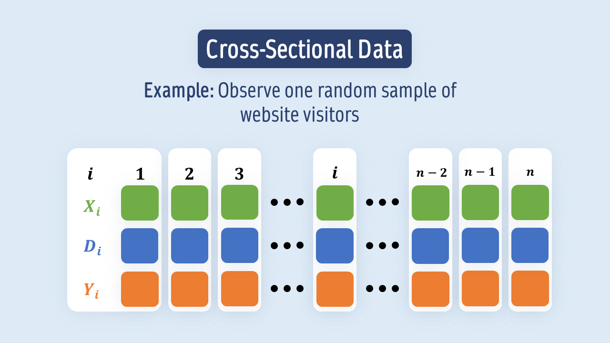
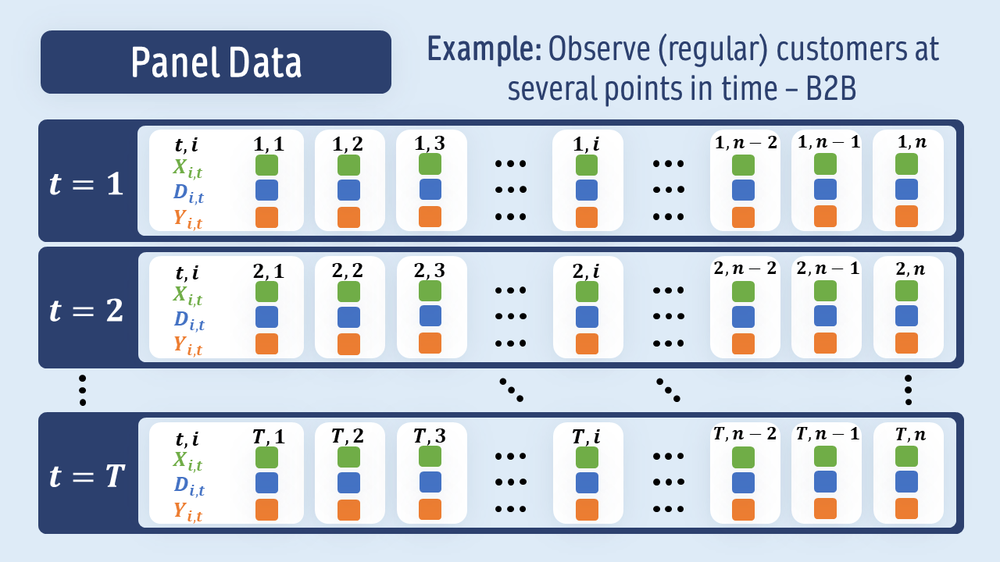
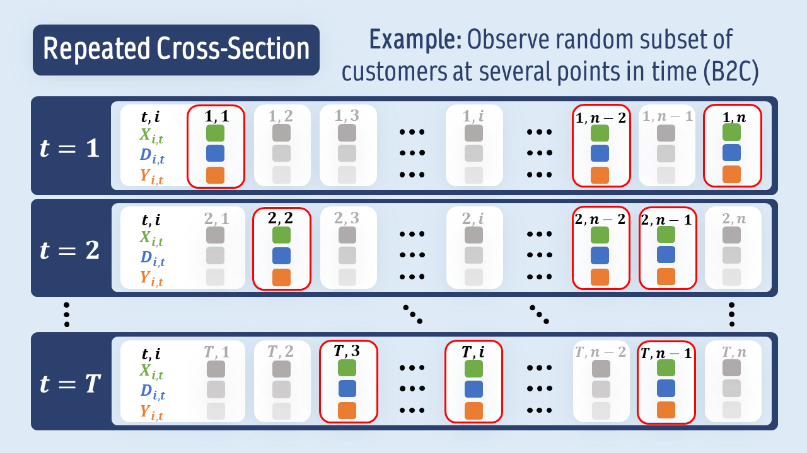
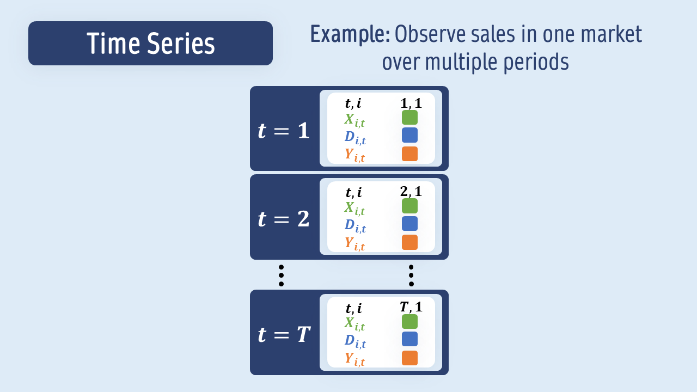
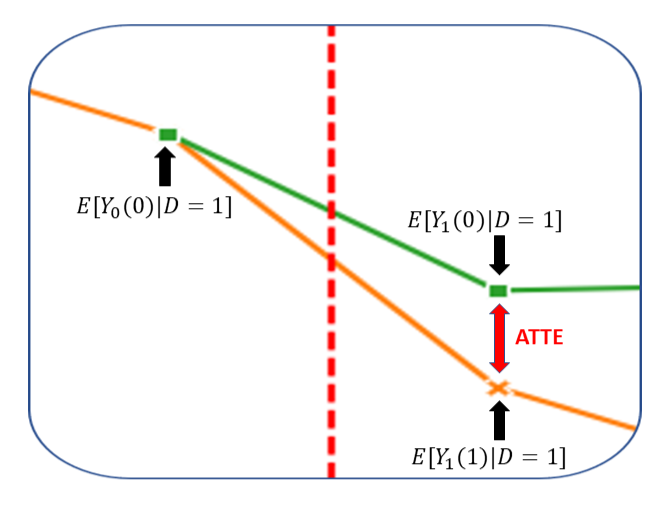
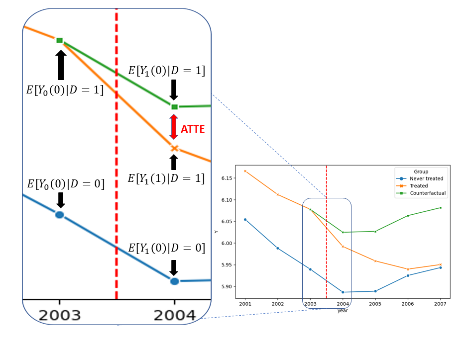
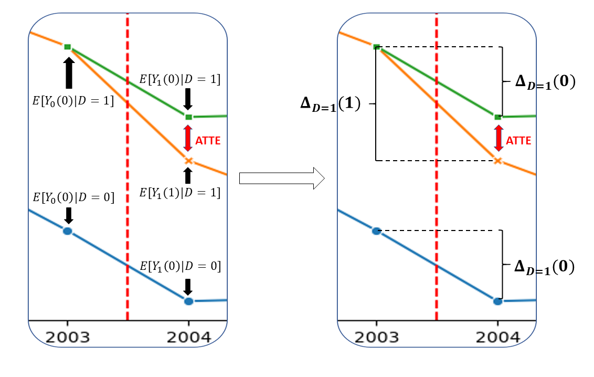
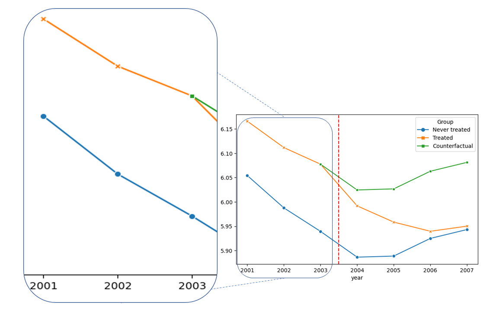

# Difference-in-Differences

## Motivation

:::: {.columns}

::: {.column width="50%"}

- So far: Cross-sectional data
  * At a given point in time $t$, we observe $n$ individuals (i.i.d)

- Now: Panel data and repeated cross-sectional data
  * We observe data for individuals at multiple points in time

- How can we estimate a causal effect in such a setting?

:::

::: {.column width="50%"}

<center>

</center>

:::

::::


## Motivation


:::: {.columns}

::: {.column width="50%"}


- **D**ifference-**in**-**D**ifferences (DiD) is one of the most popular identification strategies

<br>

#### Stylized example:

- Consider 2 US states
- One introduced a higher minimum wage in 2003, the other not

> *What is the causal effect of **a minimum wage increase** on **youth unemployment**?*

:::

::: {.column width="50%"}

<center>

</center>


:::

::::


## Motivation


:::: {.columns}

::: {.column width="50%"}


- **D**ifference-**i**n-**D**ifferences (DiD) is one of the most popular identification strategies

<br>

#### Stylized example:

- Consider 2 US states
- One introduced a higher minimum wage in 2003, the other not

> *What is the causal effect of **a minimum wage increase** on **youth unemployment**?*


:::

::: {.column width="50%"}

<center>

</center>


- The underlying assumptions must apply to *what would have happened in the treated state would it not have been treated in 2003*: **Parallel trends**


:::

::::


## Data Types


<br>

:::: {.columns}

::: {.column width="50%"}

### Panel Data

#### Observe a subsample of individuals over a time period

<br>
Example: 

*Business to Business*

:::

::: {.column width="50%"}


### Repeated Cross Sections

#### At each time, observe a subsample of individuals

<br>
Example:

*Business to Consumer*

:::

::::

## Motivation: Types of Data




## Motivation: Types of Data



## Motivation: Types of Data



## Motivation: Types of Data




## Setting: 2 Time Periods

 - Two time periods: $t=0$ pre-treatment and $t=1$ post-treatment

 - $Y_{t}$: Outcome of interest at time $t$

 - $D_{}$: Treatment indicator if treated between $t=0$ and $t=1$ (binary treatment)
 
 - $Y_{t}(0)$: Potential outcome of interest at time $t$ if **not** treated up until $1$
 
 - $Y_{t}(1)$: Potential outcome of interest at time $t$ if treated up until $1$

<center>
{width=450}
</center>

## Motivation

- The conterfactuals (green) are not observed

- Rely on the group of untreated units (blue) to estimate the counterfactuals

<center>
{width=700}
</center>


## Motivation

#### Key assumption: Parallel trends
$$
\underbrace{\mathbb{E}[Y_{1}(0)|D=1] - \mathbb{E}[Y_{0}(0)|D=1] }_{=\Delta_{D=1}(0)}= \underbrace{\mathbb{E}[Y_{1}(0)|D=0] - \mathbb{E}[Y_{0}(0)|D=0]}_{=\Delta_{D=0}(0)}
$$

<center>
{width=700}
</center>

## Motivation

- The parameter of interest is the **average treatment effect on the treated (ATTE)**:
$$
\theta_0:=\mathbb{E}[Y_{1}(1) - Y_{1}(0)| D=1]
$$

- If the parallel trends assumptions is satisfied, the **ATTE** can be identified by


$$
\begin{align*}
\theta_0:
&= \underbrace{\Delta_{D=1}(1)}_{\text{Difference in treated}} - \underbrace{\Delta_{D=0}(0)}_{\text{Difference in untreated}}
\end{align*}
$$

## Extension of the Parallel Trend Assumption

 - The parallel trend assumption might be very hard to justify

 - Usually there are some previous conditions which influence the trend of the outcome (e.g. economic growth, population, etc.)

. . .

 - Extend the parallel trend assumption to hold conditional on some covariates $X$

#### Conditional parallel trends
$$
\mathbb{E}[Y_{1}(0) - Y_{0}(0)|X, D=1] = \mathbb{E}[Y_{1}(0) - Y_{0}(0)|X, D=0]
$$

## Identifying Assumptions

#### Conditional parallel trends:
$$
\mathbb{E}[Y_{1}(0) - Y_{0}(0)|X, D=1] = \mathbb{E}[Y_{1}(0) - Y_{0}(0)|X, D=0]
$$

#### No anticipation:
$$
\mathbb{E}[Y_{0}(0)|X, D=1] = \mathbb{E}[Y_{0}(1)|X, D=1]
$$

#### Overlap:
$$
\exists\epsilon > 0: P(D=1|X) > \epsilon \text{ and } P(D=1|X) \le 1-\epsilon
$$


## Outlook: Extensions

- So far, we considered a setting with 2 periods

- It's possible to extend the idea to settings with multiple periods, see for example @callaway2021difference

- Moreover, it is possible to use sensitivity analysis as of @chernozhukov2022 for Difference-in-Differences

- Overview on Difference-in-Differences models: Chapter 7 of @huber2023, Chapter 15 in @victorbook, @callaway2022difference and @roth2023 for more recent developments


# Panel Data

## Panel Data - Observational Setting

- Observations are iid. of the form $W=(Y_{0}, Y_{1}, D, X)$

- Score implemented as proposed in @chang2020double, @sant2020doubly and @zimmert2018efficient
$$
\psi(W,\theta,\eta) = -\frac{D}{p}\theta + \frac{D - m(X)}{p(1-m(X))}(Y_{1} - Y_{0}- g(0,X))
$$
with $\eta=(g, m, p)$.

 - Nuisance components
$$
\begin{align*}
p_0 &= \mathbb{E}[D]\\
m_0(X) &= P(D=1|X)\\
g_0(0,X) &= \mathbb{E}[Y_{1} - Y_{0}|D=0, X]
\end{align*}
$$

## Implementation - Data Backend

- Take a look at the data example

```{python}
#| code-fold: true
#| eval: false
#| echo: true
import numpy as np
import pandas as pd

df_subset = pd.read_csv("datasets/did_data/subset_did.csv")

# restrict to two time periods
df = df_subset.loc[(df_subset.year == 2003) | (df_subset.year==2004)].copy()
df.head(n=3)
```

```{python}
#| echo: false

import numpy as np
import pandas as pd

df_subset = pd.read_csv("datasets/did_data/subset_did.csv")

# restrict to two time periods
df = df_subset.loc[(df_subset.year == 2003) | (df_subset.year==2004)].copy()
df.head(n=3)
```


## Implementation - Data Backend

- `DoubleMLDIDData` is constructed for a univariate outcome `y` $\Rightarrow$ Use $\Delta Y_{} = Y_{1} - Y_{0}$

- Choose features as pre-treatment covariates

. . .

```{python}
#| code-fold: true
#| echo: true

def compute_difference(values):
    return values.iloc[1] - values.iloc[0]

df_diff = df.groupby("id").agg({"lpop": "first",
                                "lavg_pay": "first",
                                "region_2": "first",
                                "region_3": "first",
                                "region_4": "first",
                                "D": "first",
                                "Y": compute_difference}).reset_index()
df_diff.head(n=5)
```

## Implementation - Data Backend

- Construct a basic `DoubleMLDIDData` object


```{python}

#| echo: true
#| code-line-numbers: "7-9"

from doubleml import DoubleMLDIDData

dml_data = DoubleMLDIDData(df_diff, y_col="Y", d_cols="D",
                        x_cols=["lpop", "lavg_pay", "region_2", "region_3", "region_4"])
print(dml_data)

```

## Implementation - Model Class {auto-animate=true}

- Implemented via the `DoubleMLDID` class

```{python}
#| echo: true
#| code-line-numbers: "8-10"

from doubleml import DoubleMLDID
from sklearn.ensemble import RandomForestRegressor, RandomForestClassifier
from sklearn.base import clone

ml_g = RandomForestRegressor()
ml_m = RandomForestClassifier()

dml_did = DoubleMLDID(dml_data,
                      ml_g=clone(ml_g),
                      ml_m=clone(ml_m))
```

## Implementation - Estimation {auto-animate=true}

- Estimation via the `fit()` method

```{python}
#| echo: false
np.random.seed(42)
```

```{python}
#| echo: true
#| code-line-numbers: "11-12"

from doubleml import DoubleMLDID
from sklearn.ensemble import RandomForestRegressor, RandomForestClassifier
from sklearn.base import clone

ml_g = RandomForestRegressor()
ml_m = RandomForestClassifier()

dml_did = DoubleMLDID(dml_data,
                      ml_g=clone(ml_g),
                      ml_m=clone(ml_m))
dml_did.fit()
print(dml_did.summary)
```


## Implementation - Default values {auto-animate=true}

- Learner `ml_m` is only relevant for `score=observational`

```{python}
#| echo: true
#| eval: false
#| code-line-numbers: "5,6,9,10"

from doubleml import DoubleMLDID
from lightgbm import LGBMClassifier, LGBMRegressor

dml_did = DoubleMLDID(dml_data,
                      ml_g,
                      ml_m=None,
                      n_folds=5,
                      n_rep=1,
                      score='observational',
                      in_sample_normalization=True,
                      dml_procedure='dml2',
                      trimming_rule='truncate',
                      trimming_threshold=0.01,
                      draw_sample_splitting=True,
                      apply_cross_fitting=True)
```

# Pre-Testing

## Pre-Testing

 - The crucial assumption for the identification of the ATTE is the conditional parallel trends assumption

 - Pre-testing is a common approach to check the validity of the conditional parallel trends assumption

. . .

 - If multiple time periode pre-treatment are available, the "treatment" effect can be estimated for each pre-treatment period

<center>
{width=500}
</center>

## Pre-Testing - Data Backend

- Select the additional pre-treatment periods from $2001$ and $2002$

```{python}
#| code-fold: true
#| echo: true

# restrict to two periods before treatment
df_subset.loc[(df_subset.year < 2004)].head(n=4)
```

## Pre-Testing - Estimation

 - Loop over the time periods and estimate the corresponding treatment effects

```{python}
#| code-fold: show
#| echo: true

years = [2002, 2003, 2004]
df_pretest = pd.DataFrame({'year': years, 'effect': np.nan, 'lower': np.nan, 'upper': np.nan})
for t_idx, t in enumerate([2001, 2002, 2004]):
  df = df_subset.loc[(df_subset.year == t) | (df_subset.year==2003)].copy()
  df_diff = df.groupby("id").agg({"lpop": "first", "lavg_pay": "first",
                                  "region_2": "first", "region_3": "first",
                                  "region_4": "first", "D": "first",
                                  "Y": compute_difference}).reset_index()
  dml_data = DoubleMLDIDData(df_diff, y_col="Y", d_cols="D",
                          x_cols=["lpop", "lavg_pay", "region_2", "region_3", "region_4"])
  dml_did = DoubleMLDID(dml_data,
                        ml_g=clone(ml_g),
                        ml_m=clone(ml_m))
  dml_did.fit()
  df_pretest.loc[t_idx, 'effect'] = dml_did.coef
  df_pretest.loc[t_idx, 'lower'] = dml_did.confint()['2.5 %'].iloc[0]
  df_pretest.loc[t_idx, 'upper'] = dml_did.confint()['97.5 %'].iloc[0]


```

## Pre-Testing - Results

 - Let's take a look at the results

```{python}
#| code-fold: true
df_pretest
```

## Pre-Testing - Results

- It is always helpful to visualize the estimates

```{python}
#| code-fold: true

import matplotlib.pyplot as plt
fig, ax = plt.subplots()

errors = np.full((2, df_pretest.shape[0]), np.nan)
errors[0, :] = df_pretest['effect'] -   df_pretest['lower']
errors[1, :] = df_pretest['upper'] - df_pretest['effect']

plt.errorbar(df_pretest['year'], df_pretest['effect'], fmt='o', yerr=errors, color='#1F77B4',
             ecolor='#1F77B4', label='Estimated Effect (with CI)')
ax.plot(df_pretest['year'], df_pretest['effect'], linestyle='--', color='#1F77B4', linewidth=1)

ax.axhline(y=0, color='black', linestyle='--', linewidth=1)
ax.axvline(x=2003.5, color='red', linestyle='dashed')

plt.xlabel('Year')
plt.xticks(range(2002, 2005))
plt.legend()
_ = plt.ylabel('Effect and 95%-CI')
```


## Multiple time periods


- We can include multiple time periods in the same manner

```{python}
#| code-fold: true
#| echo: true

df_subset.head(n=4)
```

## Multiple time periods

- Loop over the time periods from $2005$ to $2007$ and estimate the corresponding treatment effects

```{python}
#| code-fold: true
#| echo: true

years = [2005, 2006, 2007]
df_multiple_periods = pd.DataFrame({'year': years, 'effect': np.nan, 'lower': np.nan, 'upper': np.nan})

for t_idx, t in enumerate(years):
  df = df_subset.loc[(df_subset.year == 2003) | (df_subset.year==t)].copy()
  df_diff = df.groupby("id").agg({"lpop": "first",
                                "lavg_pay": "first",
                                "region_2": "first",
                                "region_3": "first",
                                "region_4": "first",
                                "D": "last",
                                "Y": compute_difference}).reset_index()
  dml_data = DoubleMLDIDData(df_diff, y_col="Y", d_cols="D",
                          x_cols=["lpop", "lavg_pay", "region_2", "region_3", "region_4"])
  dml_did = DoubleMLDID(dml_data,
                        ml_g=clone(ml_g),
                        ml_m=clone(ml_m))
  dml_did.fit()
  df_multiple_periods.loc[t_idx, 'effect'] = dml_did.coef
  confint = dml_did.confint(level=0.95)
  df_multiple_periods.loc[t_idx, 'lower'] = confint['2.5 %'].iloc[0]
  df_multiple_periods.loc[t_idx, 'upper'] = confint['97.5 %'].iloc[0]

df_multiple_periods
```


## Multiple time periods - Results

- Add the pre-testing results to the plot

```{python}
#| code-fold: true

df_did = pd.concat([df_pretest, df_multiple_periods], axis=0)
fig, ax = plt.subplots()

errors = np.full((2, df_did.shape[0]), np.nan)
errors[0, :] = df_did['effect'] -   df_did['lower']
errors[1, :] = df_did['upper'] - df_did['effect']

plt.errorbar(df_did['year'], df_did['effect'], fmt='o', yerr=errors, color='#1F77B4',
             ecolor='#1F77B4', label='Estimated Effect (with CI)')
ax.plot(df_did['year'], df_did['effect'], linestyle='--', color='#1F77B4', linewidth=1)

ax.axhline(y=0, color='black', linestyle='--', linewidth=1)
ax.axvline(x=2003.5, color='red', linestyle='dashed')

plt.xlabel('Year')
plt.legend()
_ = plt.ylabel('Effect and 95%-CI')
```


# References

## References